# SIM866X_A11_Compilation User Guide

## ***Version History***

| **versions**|**date**   |**author**|**remark**                   |
| -------- | ---------- | -------- | -------------------------- |
| 1.00     |2025.08.29|Liu Wen| The first version
| 1.01     |2026.03.17|Yang Huakun| Second edition, docx to markdown documentation|

## 1 Introduction

This document aims to provide developers with a complete and clear set of instructions for building the software compilation environment of **SIM866X Android 11 series modules**, and to master the standard compilation process and related tools. The content covers the whole process from basic environment preparation, system installation, dependency configuration, source code compilation and product output.

With this guide, the developer can quickly complete the development environment deployment, understand how to use compiled scripts, and be able to independently complete the Android 11 platform compilation work, thus improving development efficiency and reducing common problems in the environment construction process.

## 2 Requires

### 2.1 Hardware environment requirements

- **CPU**: i5 8 core, i7 recommended
- **Memory**: At least 16 GB required, 64GB recommended
- **Hard drive**: 1T, SSD recommended

### 2.2 Software environmental requirements

#### 2.2.1 Operating system requirements

Ubuntu LTS (16.04) 64-bit is recommended.

To see the specific version number of Ubuntu, the command is:

```bash
lsb_release -a
```

#### 2.2.2 Software packages

Additional software packages required include: 

- Python 2.6 - 2.7 available at python.org 

- GNU Make 3.81 - 3.82 at gnu.org

- Git 1.7 or higher version at git-scm.com 

- openjdk-8

- OpenSSL 1.0.1f 6 Jan 2014


Description:

Ubuntu LTS version 16.04 or later version 18.04 is also supported, but different versions depend on slightly different compilation support tools.

## 3 Build a compilation environment

### 3.1 Preparing the startup disk

#### 3.1.1 Mirrors and Tools

iso image:

```
http://releases.ubuntu.com/xenial/ubuntu-16.04.7-desktop-amd64.iso
```

Production tools:

```
https://www.pendrivelinux.com/downloads/YUMI/YUMI-2.0.9.4.exe
```

#### 3.1.2 Making a startup disk

Insert a USB stick with at least 2GB of free space.

Start YUMI

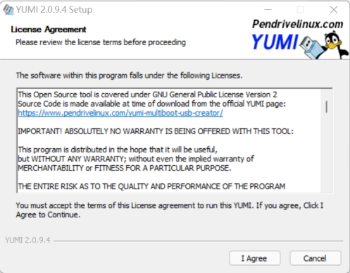 

 

Choose I Agree

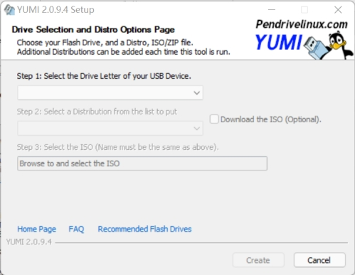 

 

Select U-Disk\OS Type\ISO image file

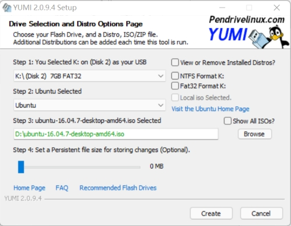 

 

Choose Create

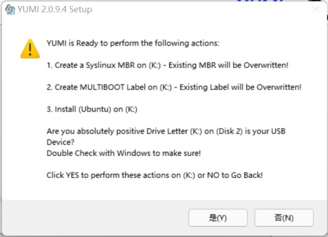 

 

Choose **\*Next\***

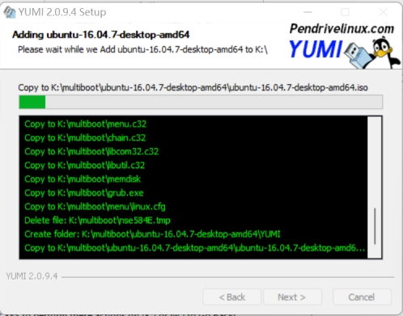 

 

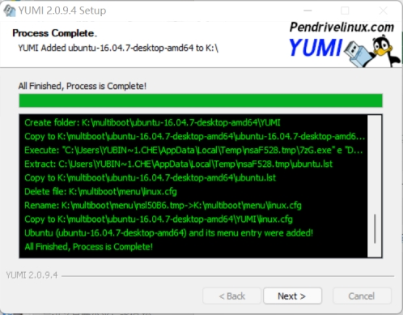 

 

Choose Next

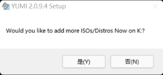 

 

Choose ***\*否(\*******\*N)\****

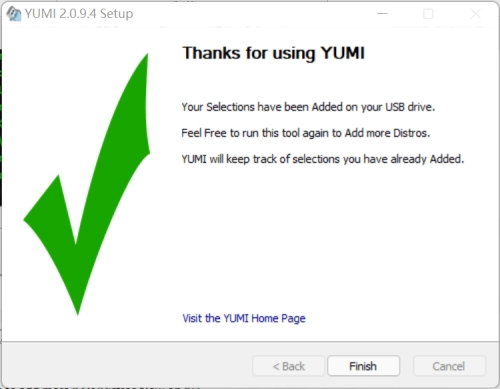 

Done!

### 3.2 Installation of the system

#### 3.2.1 Hard Disk Partitioning

Recommendations:

Allocate 50GB starting from the hard disk and install the system;

Allocate 20GB (1.5 times the size of physical memory) from the end of the hard disk to configure SWAP;

The rest of the space can be allocated to data areas.

Description:

The benefit of doing this is that even if the system fails in the future, reinstalling the system will not affect the data of other partitions

#### 3.2.2 BIOS Settings

Before installation, you need to set up the computer BIOS.

Press F2 after booting to enter BIOS setting interface and modify 2 configurations:

Boot mode：LEGACY

Secure Boot：OFF

。Plug the boot disk into the computer interface, press F12 after booting, and select USB Storage Device.

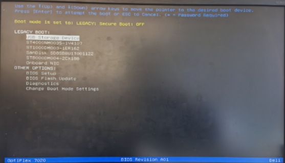 

#### 3.2.3 Start of installation

In the image below, the first option is to boot from hard disk and the second option is to boot from boot disk. choose the second one

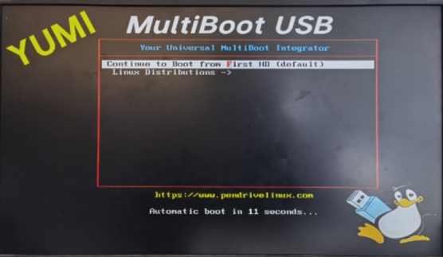 

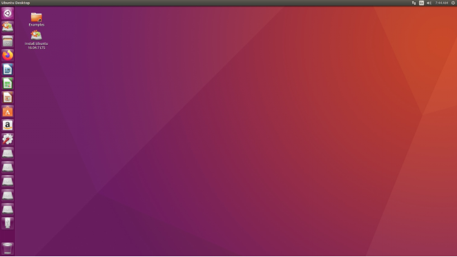 

Select Desktop\****Install\*******\*Ubuntu\*******\*16.04.6\*******\*LTS\****

 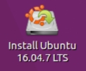

Step 1: System Language, English by default.

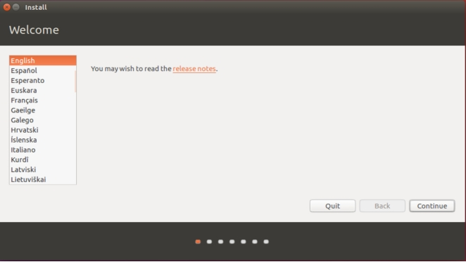 

Step 2: Keep the default and uncheck it.

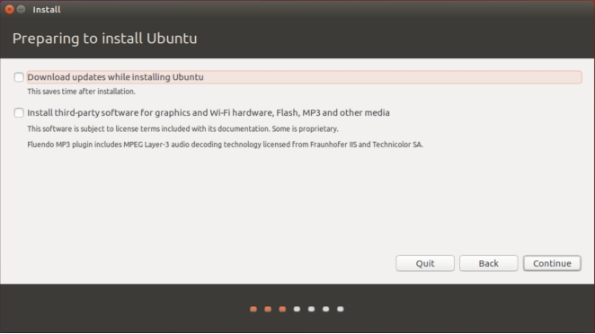 

Step 3: Installation type, it is recommended to choose the last item**Something else**

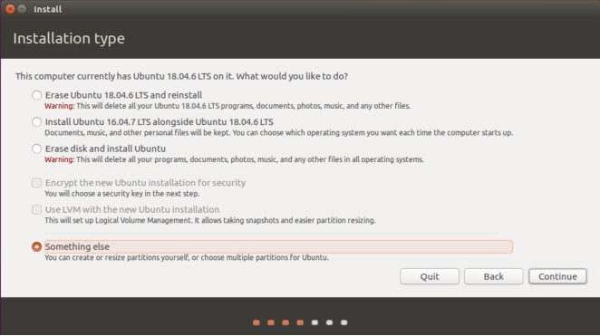 

Step 4: Select the corresponding partition, file system format, mount node

**System partition, format needs to be checked**

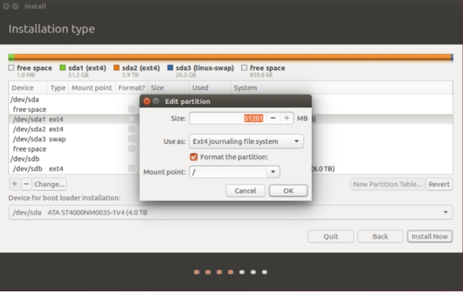 

The partitions after configuration

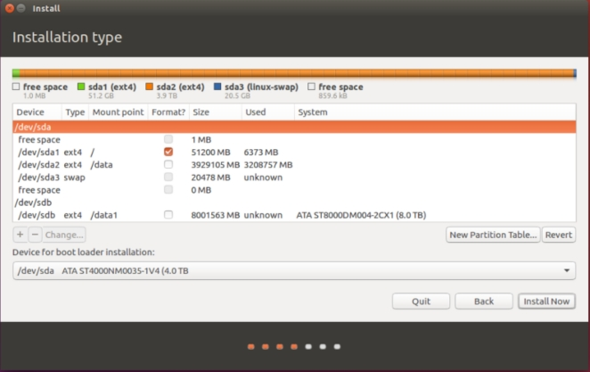 

Step 5: Select the system time zone Shanghai

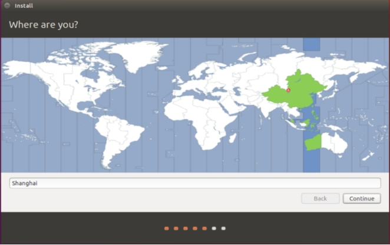 

Step 6: Keyboard layout, default English(US)

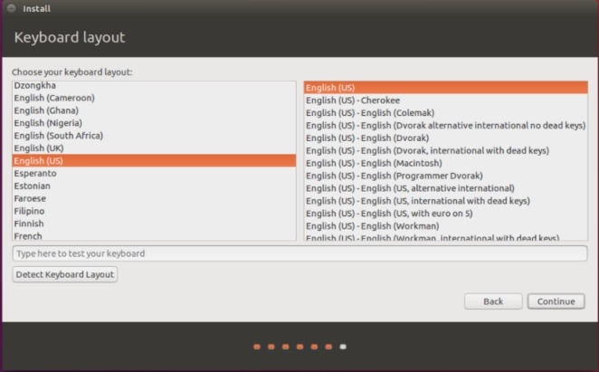 

Step 7: Enter user name, host name, password (according to the needs of their own settings)

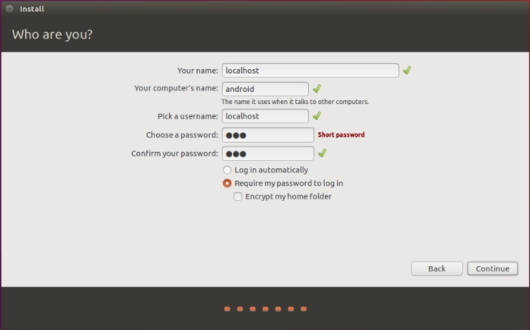 

After installation, select Restart Now.

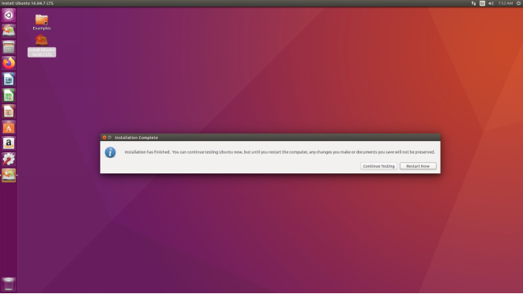 

Login interface, enter password to enter the system

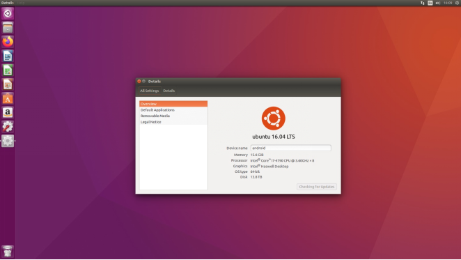 

### 3.3 Package installation

From the upper left corner of the desktop, enter Terminal to open a terminal, and enter the instructions in turn:

```bash
$ sudo apt-get update
$ sudo apt-get install git-core gnupg flex bison gperf build-essential zip curl zlib1g-dev gcc-multilib g++-multilib libc6-dev-i386 lib32ncurses5-dev x11proto-core-dev libx11-dev lib32z-dev ccache libgl1-mesa-dev libxml2-utils xsltproc unzip openjdk-8-jdk libssl-dev libxml-simple-perl python-pip
$ pip install pycrypto
```

### 3.4 Creating an ssh key

At Terminal, enter

```bash
$ ssh-keygen -t rsa -C <邮箱>
```

Press Enter to confirm (no password required)

### 3.5 Configuring git accounts

```bash
$ git config --global user.name <用户名>
$ git config --global user.email <邮箱>
```

### 3.6 Configuring bash

```bash
$ sudo dpkg-reconfigure dash
```

Select<**No**>, Enter Confirm

### 3.7 Install make

Download link:

```
http://ftp.gnu.org/pub/gnu/make/make-3.81.tar.bz2
```

After decompression, execute the following instructions in turn:

```bash
$ ./configure
$ make
$ sudo make install
$ sudo mv /usr/bin/make /usr/bin/make-4.1
$ sudo ln -sf /usr/local/bin/make /usr/bin/make
```

### 3.8 Installing openssl

Download link:

```
https://www.openssl.org/source/old/1.0.1/openssl-1.0.1f.tar.gz
```

After decompression, execute the following instructions in turn:

```
$ ./config --prefix=/usr/local --openssldir=/usr/local/openssl
$ sudo make
$ sudo mv /usr/bin/pod2man /usr/bin/pod2man_bak
$ sudo make install
$ sudo mv /usr/bin/pod2man_bak /usr/bin/pod2man
$ sudo mv /usr/bin/openssl /usr/bin/openssl.old
$ sudo mv /usr/include/openssl /usr/include/openssl.old
$ sudo ln -sf /usr/local/bin/openssl /usr/bin/openssl
$ sudo ln -sf /usr/local/include/openssl/ /usr/include/openssl
$ openssl version -a
```

### 3.9 Installing repo

Download link:

```
https://nas.simcom.com:35001/sharing/4eeM03A4p
```

```
$ mkdir ~/bin
$ cp repo ~/bin/
$ chmod 744 ~/bin/repo
```

## 4 Android build system

### 4.1 Compile source code

Android 11 executes the following command

```bash
$ cd <APPS_ROOT>/sunsea/
$ ./make_build_ap.sh SIM8666 all userdebug 16
```

```bash
执行效果如下：
RK356X_A11/sunsea$ ./make_build_ap.sh
ERROR :parameter error
format:  ./make_build_ap.sh [PROJECT] [MODULE] [userdebug/user] [thread_number]
example: ./make_build_ap.sh SIM8666 all userdebug 16
you can select below projects:
SIM8666
SIM8666_F
build module:[all] [U] [CK] [A] [p] [o] [u] [d]
No ARGS means use default build option
       all = -AUCKuo  build all
       U = build uboot
       C = build kernel with Clang
       K = build kernel
       A = build android
       p = will build packaging in IMAGE
       o = build OTA package
       u = build update.img
       cf = generate and copy all configuration files only.

```

Android 11 source code root directory is as follows:

```
├── art
├── bionic
├── bootable
├── build
├── compatibility
├── cts
├── dalvik
├── developers
├── development
├── device
├── external
├── frameworks
├── hardware
├── kernel
├── libcore
├── libnativehelper
├── mkcombinedroot
├── packages
├── pdk
├── platform_testing
├── prebuilts
├── rkbin
├── RKDocs
├── rkst
├── RKTools
├── rockdev
├── sdk
├── sunsea
├── system
├── test
├── toolchain
├── tools
├── u-boot
└── vendor
```

Build scripts in sunsea/make_build_ap.sh;

After compilation, the image is generated at rockdev/Image-rk3566_r/.

```
├── boot-debug.img
├── boot.img
├── config.cfg
├── dtbo.img
├── MiniLoaderAll.bin
├── misc.img
├── parameter.txt
├── pcba_small_misc.img
├── pcba_whole_misc.img
├── recovery.img
├── resource.img
├── super.img
├── uboot.img
├── update.img
└── vbmeta.img
└── vmlinux
```

