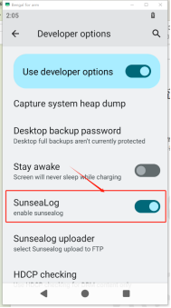
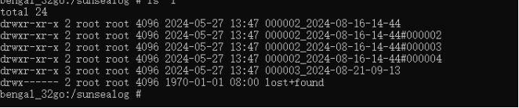
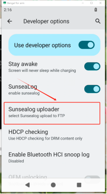
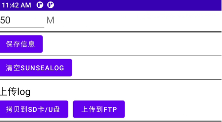
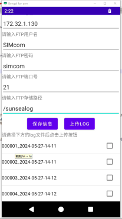
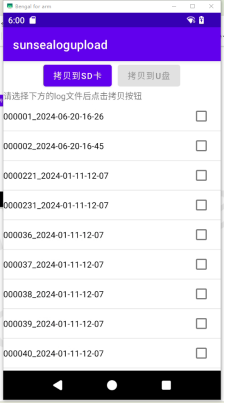
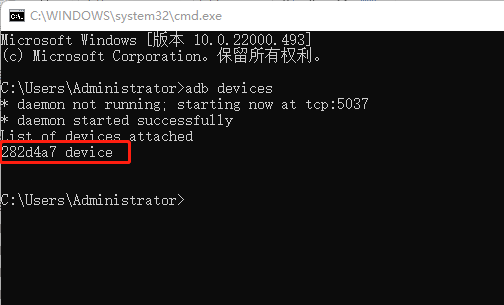
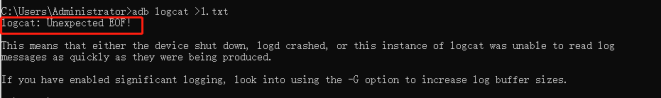
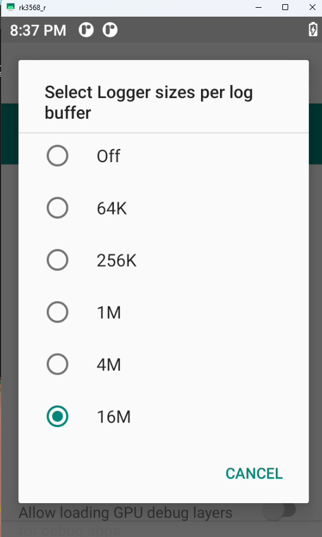
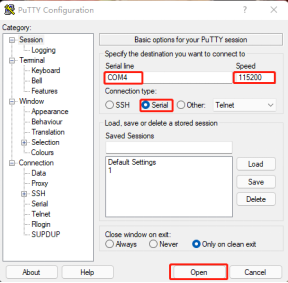

# SIM866X_AP_LOG Grab User Guide

## **Version History**

| **versions**|**date**    |**author**|**remark**         |
| :----- | :-------- | :----- | :------------- |
| 1.00   |2026.03.04| Chai Yan| The first version

## 1 Introduction 

This document takes the SIMCom SIM866X EVB development board as an example to introduce how to grab AP log on SIM866x module on Android 11 system.

## 2 Offline logs

Android offline logs are logs that are generated and stored locally by Android devices without connecting to a PC (independent of ADB).

### 2.1 Sunsealog

Sundialog is a set of tools developed based on EVB development board of SIM866X, which can capture android AP side log offline.

#### 2.1.1 Sundialog Usage Process

Sundialog function is turned off by default after power up, you need to turn on Sundialog switch in settings first. Open method:

Click on System Settings, click on the Version Number option several times in a row, open Developer Options, find the Sundialog switch in Developer Options, and set the switch to ON.

Wait a few seconds for Sundialog service to start, then you can start fetching logs. When you don't need to fetch logs, turn this switch off to avoid consuming system performance. Sundialog folder naming rule is "serial number_time #serial number", the previous serial number is a switch Sundialog, such as the first time to open Sundialog serial number is 00001, when Sundialog switch, or restart, the serial number plus 1, is 000002. When Sundialog is opened once, when the size of a single log folder exceeds 50M, a new folder will be regenerated. The number in front of the newly generated folder remains unchanged, and the number behind it increases by 1. The size of each log folder is 50M, and the maximum storage limit of the partition is 200M. When the log file is full of partitions, the old log folder will be deleted automatically to ensure that the new log file can continue to be stored. The deletion rule is to sort folders according to their serial numbers and delete the folder with the highest serial number.

The captured log is in the sunsealog partition of the device. At this point, you can pull the log out to view it. The command is adb pull sunsealog

#### 2.1.2 Sundialog upload function

This function can upload Sundialog to FTP server or transfer to USB flash drive/SD card. How to use:

First, in the developer options of the settings, click the Sundialog uploader option.

In this interface, you can set the size of each log folder, copy to SD card/USB disk, upload to FTP, etc.

(1)Upload to FTP function:

Click the Upload to FTP button to enter the FTP upload interface. After connecting to the network, enter the FTP address, username, password, port number and FTP storage path according to the prompts.

After filling in the information, you can click the save information button, so that you can save the information the next time you enter it, you don't need to fill it again. Then select the log folder to upload, support single or multiple choices. Then click the Upload Log button to upload it. Wait for the upload progress bar to disappear, indicating that the upload is complete. At this time, you can view the corresponding sunsealog in FTP.

(2)Copy to USB flash drive/SD card function:

Click the Upload to USB/SD card button to enter the upload interface. This function can copy log files to USB or SD card.

## 3 Real-time logs

Android real-time logging refers to a logging system that captures, displays, and processes logs instantly.

### 3.1 USB port via device

When the device can be connected to a computer and has an adb port, you can directly use the adb tool to grab it in case of problems such as app flashback, error, slow system boot, stutter, and system animation.

#### 3.1.1 Download adb toolkit

adb tools can be found in the platform-tools folder in Android SDK\Tools\Adb&Fastboot path.

#### 3.1.2 Open the adb tool

Open windows cmd tool, navigate to the folder where adb.exe is located, and enter adb command

#### 3.1.3 View Connected Devices

Adb devices, if you press enter and a alphanumeric combination appears, it means that the device is connected successfully!

If no device is displayed, please check whether USB debugging is enabled in the device developer options and whether the USB cable is connected.

#### 3.1.4 Entering the Grab Command

adb logcat -b all -v time >1.txt This saves all logs to 1.txt

Repeat the problem, press Ctrl+C after the problem occurs to cancel the log grab

adb logcat -c

Empty old logs

Note: If logcat:Unexpected EOF! This log, because the final logcat process exits, and the reason for exiting is that the log buffer size is set too small, and the default size is 256KB. If your program runs for a long time and generates a large number of logs, the final log cache size must exceed the default size of 256KB.

At this time, you need to open the settings--about the phone--press the version number 7 times in a row to enter the developer mode

Then go to System--Developer Options--Logger Buffer Size

Choose the right size

You can also set the log cache size using the adb command:

adb logcat -G 16M

Set the log cache size to 16M.

Kernel log grab command

adb shell dmesg > 1.txt

You can also directly use batch files to grab all logs for developers to analyze

mkdir Android_Log

start cmd /c "adb logcat -b radio -v time>Android_Log\radio.txt"

start cmd /c "adb logcat -b events -v time>Android_Log\events.txt"

start cmd /c "adb logcat -b system -v time>Android_Log\system.txt"

start cmd /c "adb shell top>Android_Log\top.txt"

start cmd /c "adb shell dmesg>Android_Log\kernal.txt"

adb logcat -v time>Android_Log\main.txt

@pause

This batch file is in the downloaded adb tool

### 3.2 WiFi connection via device

When you need to debug usb function usb is occupied when you can use wifi grab

#### 3.2.1 How to use

Connect usb cable input adb tcpip 5555   Switch the adb of the device to tcp mode

Devices and computers are under the same local area network

Unplug the usb cable and enter adb connect xxx.xx.xx.xxx:5555

### 3.3 Capture via serial port

Android through serial capture Log is mainly used for device development, system debugging, no adb environment log acquisition.

#### 3.3.1 How to use

1. Download the corresponding number of software to the local

2. The download is directly an executable file named putty.exe, which can be used without installation. Double-click to open it and enter Putty's main interface.

3. Connect the device with a Micro USB cable, add a recognized serial port, change the bit rate to 115200, select Serial (serial port) as the connection type, and then click open,

Press Enter to verify connection

4. Enter logcat to grab log. Ctrl+C Stop

### 3.4 Network problems

Tcpdump is a package capture tool under linux, not in android, you need to download the corresponding tool.

Download address: www.androidtcpdump.com/android-tcpdump/downloads

And then through adb into the corresponding directory:

adb root

adb push tcpdump /data/local/tmp

Execute the packet capture command:

adb shell chmod +x /data/local/tmp/tcpdump

adb shell tcpdump -i any -p -vv -s 0 -w capture.pcap

Starting capture will create a capture.pacp file in the current directory, which will increase in size as the number of network visits increases.

If you want to close it, press ctrl+c to finish, and then export the file to your computer, you can use wireshark to analyze it.

### 3.5 Exceptional circumstances

Due to the complexity of fixed screen problems, more on-site information is required. For this reason, the following operations are required to confirm the on-site information:

Step 1: Record the time point and operation steps of the fixed screen, and take photos.

Step 2 Confirm whether adb can be connected. Enter "adb devices" on cmd command line to see if you can print out mobile phone information.

Step 3: Call the tester if there is SIM card. If you hear the ring, you can judge whether the modem works normally.

Step 4: Press the "power key" and the volume key 2 to 3 times within 5 minutes to see if there is any change in the screen.

Step 5 If the system is still in the fixed screen state after the above operations, you need to grab sysdump log and export Log through adb shell dumpsys activity command.

