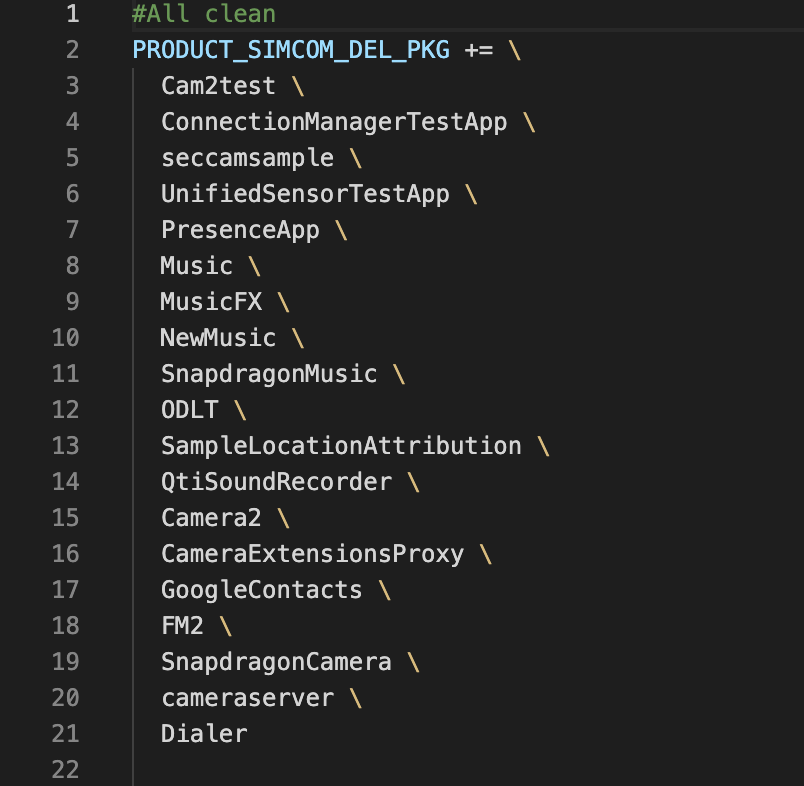
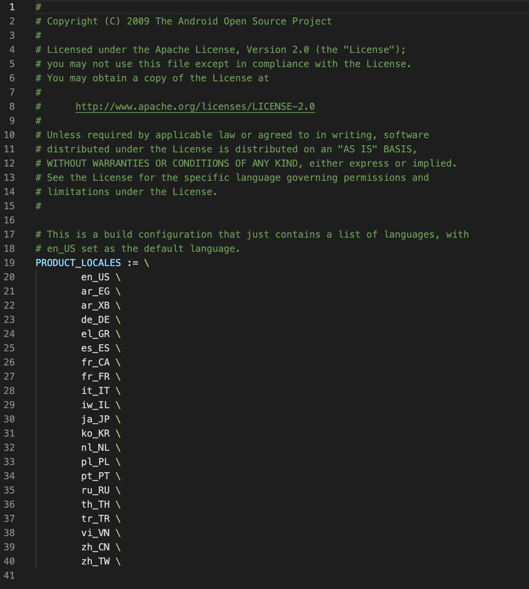
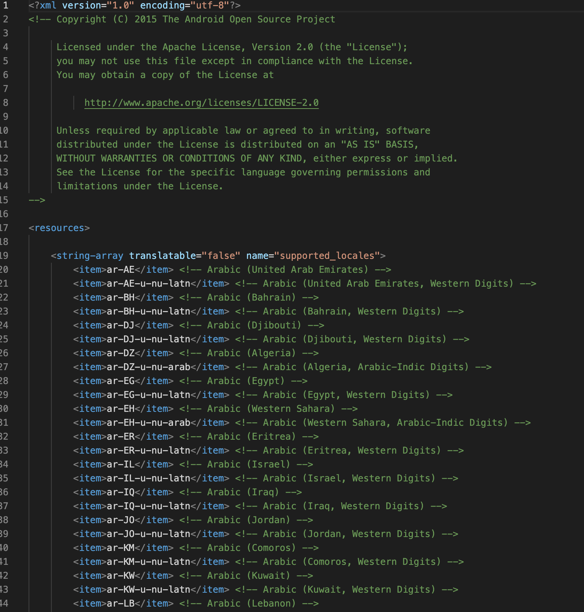
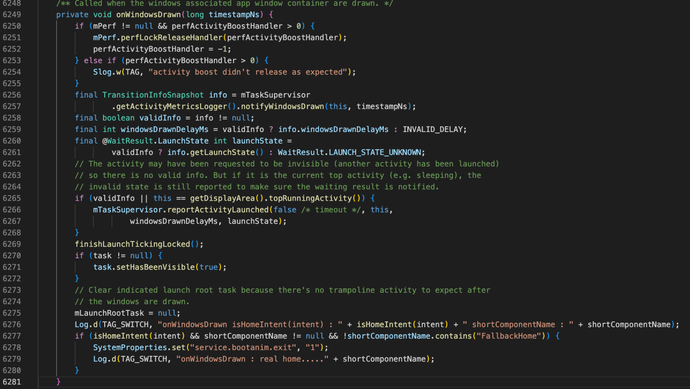

# SIM866X_BOOT Start Speed Optimization User Guide

## **Version History**

| **versions**|**date**    |**author**|**remark**         |
| :----- | :-------- | :----- | :------------- |
| 1.00   |2026.03.04| Zhang Haifeng| The first version  |

## 1 Scope of application

This document applies to Android11 version of SIMCom SIM866X series.

## 2 presents

### 2.1 Purpose of this article

This document provides SIM866X Android 11 platform startup optimization scheme and further optimization modification method.
By referencing this application documentation, developers can quickly understand and develop related businesses.

## 3 System Application Clipping

In the Android Build System, a system application clipping framework has been added to clip redundant system applications in a unified location.

### 3.1 System Application Clipping Framework

The requested URL/make/target/product/simcom_all_clean_product.mk was not found on this server.
It reads as follows:

If a new app needs to be cropped, simply continue adding the NAME of the cropped app in the PRODUCT_SIMCOM_DEL_PKG field in simcom_all_clean_product.mk, as formatted.

## 4 system language tailoring

The languages supported in the system are tailored, and the system language resources are distributed in two system files, Languages_default.mk and locale_config.xml.

### 4.1 languages_default.mk content clipping

build/make/target/product/languages_default.mk

Delete redundant language, leaving only needed language

### 4.2 Locale_config.xml Content Clipping

frameworks/base/core/res/res/values/locale_config.xml
Delete redundant language, leaving only needed language

Full language information:
Support for these 19 languages
Chinese zh_CN
    <item>zh-Hans-CN</item> <!-- Chinese (Simplified, China) -->
    <item>zh-Hans-HK</item> <!-- Chinese (Simplified, Hong Kong) -->
    <item>zh-Hans-MO</item> <!-- Chinese (Simplified, Macao) -->
    <item>zh-Hans-SG</item> <!-- Chinese (Simplified, Singapore) -->
Traditional Chinese zh_TW
    <item>zh-Hant-HK</item> <!-- Chinese (Traditional, Hong Kong) -->
    <item>zh-Hant-MO</item> <!-- Chinese (Traditional, Macao) -->
    <item>zh-Hant-TW</item> <!-- Chinese (Traditional, Taiwan) -->
English en_US
    <item>en-US</item> <!-- English (United States) -->
German de_DE
    <item>de-AT</item> <!-- German (Austria) -->
    <item>de-BE</item> <!-- German (Belgium) -->
    <item>de-CH</item> <!-- German (Switzerland) -->
    <item>de-DE</item> <!-- German (Germany) -->
    <item>de-IT</item> <!-- German (Italy) -->
    <item>de-LI</item> <!-- German (Liechtenstein) -->
    <item>de-LU</item> <!-- German (Luxembourg) -->
Spanish es_ES
    <item>es-AR</item> <!-- Spanish (Argentina) -->
    <item>es-BO</item> <!-- Spanish (Bolivia) -->
    <item>es-BR</item> <!-- Spanish (Brazil) -->
    <item>es-BZ</item> <!-- Spanish (Belize) -->
    <item>es-CL</item> <!-- Spanish (Chile) -->
    <item>es-CO</item> <!-- Spanish (Colombia) -->
    <item>es-CR</item> <!-- Spanish (Costa Rica) -->
    <item>es-CU</item> <!-- Spanish (Cuba) -->
    <item>es-DO</item> <!-- Spanish (Dominican Republic) -->
    <item>es-EA</item> <!-- Spanish (Ceuta & Melilla) -->
    <item>es-EC</item> <!-- Spanish (Ecuador) -->
    <item>es-ES</item> <!-- Spanish (Spain) -->
    <item>es-GQ</item> <!-- Spanish (Equatorial Guinea) -->
    <item>es-GT</item> <!-- Spanish (Guatemala) -->
    <item>es-HN</item> <!-- Spanish (Honduras) -->
    <item>es-IC</item> <!-- Spanish (Canary Islands) -->
    <item>es-MX</item> <!-- Spanish (Mexico) -->
    <item>es-NI</item> <!-- Spanish (Nicaragua) -->
    <item>es-PA</item> <!-- Spanish (Panama) -->
    <item>es-PE</item> <!-- Spanish (Peru) -->
    <item>es-PH</item> <!-- Spanish (Philippines) -->
    <item>es-PR</item> <!-- Spanish (Puerto Rico) -->
    <item>es-PY</item> <!-- Spanish (Paraguay) -->
    <item>es-SV</item> <!-- Spanish (El Salvador) -->
    <item>es-US</item> <!-- Spanish (United States) -->
    <item>es-UY</item> <!-- Spanish (Uruguay) -->
    <item>es-VE</item> <!-- Spanish (Venezuela) -->
Portugal pt_PT
    <item>pt-AO</item> <!-- Portuguese (Angola) -->
    <item>pt-BR</item> <!-- Portuguese (Brazil) -->
    <item>pt-CH</item> <!-- Portuguese (Switzerland) -->
    <item>pt-CV</item> <!-- Portuguese (Cape Verde) -->
    <item>pt-GQ</item> <!-- Portuguese (Equatorial Guinea) -->
    <item>pt-GW</item> <!-- Portuguese (Guinea-Bissau) -->
    <item>pt-LU</item> <!-- Portuguese (Luxembourg) -->
    <item>pt-MO</item> <!-- Portuguese (Macao) -->
    <item>pt-MZ</item> <!-- Portuguese (Mozambique) -->
    <item>pt-PT</item> <!-- Portuguese (Portugal) -->
    <item>pt-ST</item> <!-- Portuguese (São Tomé & Príncipe) -->
    <item>pt-TL</item> <!-- Portuguese (Timor-Leste) -->
Korean ko_KR
    <item>ko-KP</item> <!-- Korean (North Korea) -->
    <item>ko-KR</item> <!-- Korean (South Korea) -->
Italian it_IT
    <item>it-CH</item> <!-- Italian (Switzerland) -->
    <item>it-IT</item> <!-- Italian (Italy) -->
    <item>it-SM</item> <!-- Italian (San Marino) -->
    <item>it-VA</item> <!-- Italian (Vatican City) -->
Dutch nl_NL
    <item>nl-AW</item> <!-- Dutch (Aruba) -->
    <item>nl-BE</item> <!-- Dutch (Belgium) -->
    <item>nl-BQ</item> <!-- Dutch (Caribbean Netherlands) -->
    <item>nl-CW</item> <!-- Dutch (Curaçao) -->
    <item>nl-NL</item> <!-- Dutch (Netherlands) -->
    <item>nl-SR</item> <!-- Dutch (Suriname) -->
    <item>nl-SX</item> <!-- Dutch (Sint Maarten) -->
Russian ru_RU
    <item>ru-BY</item> <!-- Russian (Belarus) -->
    <item>ru-KG</item> <!-- Russian (Kyrgyzstan) -->
    <item>ru-KZ</item> <!-- Russian (Kazakhstan) -->
    <item>ru-MD</item> <!-- Russian (Moldova) -->
    <item>ru-RU</item> <!-- Russian (Russia) -->
    <item>ru-UA</item> <!-- Russian (Ukraine) -->
French        fr_CAfr_FR
    <item>fr-BE</item> <!-- French (Belgium) -->
    <item>fr-BF</item> <!-- French (Burkina Faso) -->
    <item>fr-BI</item> <!-- French (Burundi) -->
    <item>fr-BJ</item> <!-- French (Benin) -->
    <item>fr-BL</item> <!-- French (St. Barthélemy) -->
    <item>fr-CA</item> <!-- French (Canada) -->
    <item>fr-CD</item> <!-- French (Congo - Kinshasa) -->
    <item>fr-CF</item> <!-- French (Central African Republic) -->
    <item>fr-CG</item> <!-- French (Congo - Brazzaville) -->
    <item>fr-CH</item> <!-- French (Switzerland) -->
    <item>fr-CI</item> <!-- French (Côte d’Ivoire) -->
    <item>fr-CM</item> <!-- French (Cameroon) -->
    <item>fr-DJ</item> <!-- French (Djibouti) -->
    <item>fr-DZ</item> <!-- French (Algeria) -->
    <item>fr-FR</item> <!-- French (France) -->
    <item>fr-GA</item> <!-- French (Gabon) -->
    <item>fr-GF</item> <!-- French (French Guiana) -->
    <item>fr-GN</item> <!-- French (Guinea) -->
    <item>fr-GP</item> <!-- French (Guadeloupe) -->
    <item>fr-GQ</item> <!-- French (Equatorial Guinea) -->
    <item>fr-HT</item> <!-- French (Haiti) -->
    <item>fr-KM</item> <!-- French (Comoros) -->
    <item>fr-LU</item> <!-- French (Luxembourg) -->
    <item>fr-MA</item> <!-- French (Morocco) -->
    <item>fr-MC</item> <!-- French (Monaco) -->
    <item>fr-MF</item> <!-- French (St. Martin) -->
    <item>fr-MG</item> <!-- French (Madagascar) -->
    <item>fr-ML</item> <!-- French (Mali) -->
    <item>fr-MQ</item> <!-- French (Martinique) -->
    <item>fr-MR</item> <!-- French (Mauritania) -->
    <item>fr-MU</item> <!-- French (Mauritius) -->
    <item>fr-NC</item> <!-- French (New Caledonia) -->
    <item>fr-NE</item> <!-- French (Niger) -->
    <item>fr-PF</item> <!-- French (French Polynesia) -->
    <item>fr-PM</item> <!-- French (St. Pierre & Miquelon) -->
    <item>fr-RE</item> <!-- French (Réunion) -->
    <item>fr-RW</item> <!-- French (Rwanda) -->
    <item>fr-SC</item> <!-- French (Seychelles) -->
    <item>fr-SN</item> <!-- French (Senegal) -->
    <item>fr-SY</item> <!-- French (Syria) -->
    <item>fr-TD</item> <!-- French (Chad) -->
    <item>fr-TG</item> <!-- French (Togo) -->
    <item>fr-TN</item> <!-- French (Tunisia) -->
    <item>fr-VU</item> <!-- French (Vanuatu) -->
    <item>fr-WF</item> <!-- French (Wallis & Futuna) -->
    <item>fr-YT</item> <!-- French (Mayotte) -->
Turkish tr_TR
    <item>tr-CY</item> <!-- Turkish (Cyprus) -->
    <item>tr-TR</item> <!-- Turkish (Turkey) -->
Vietnam vi_VN
    <item>vi-VN</item> <!-- Vietnamese (Vietnam) -->
Polish pl_PL
    <item>pl-PL</item> <!-- Polish (Poland) -->
Arabic ar_EGar_XB
    <item>ar-AE</item> <!-- Arabic (United Arab Emirates) -->
    <item>ar-AE-u-nu-latn</item> <!-- Arabic (United Arab Emirates, Western Digits) -->
    <item>ar-BH</item> <!-- Arabic (Bahrain) -->
    <item>ar-BH-u-nu-latn</item> <!-- Arabic (Bahrain, Western Digits) -->
    <item>ar-DJ</item> <!-- Arabic (Djibouti) -->
    <item>ar-DJ-u-nu-latn</item> <!-- Arabic (Djibouti, Western Digits) -->
    <item>ar-DZ</item> <!-- Arabic (Algeria) -->
    <item>ar-DZ-u-nu-arab</item> <!-- Arabic (Algeria, Arabic-Indic Digits) -->
    <item>ar-EG</item> <!-- Arabic (Egypt) -->
    <item>ar-EG-u-nu-latn</item> <!-- Arabic (Egypt, Western Digits) -->
    <item>ar-EH</item> <!-- Arabic (Western Sahara) -->
    <item>ar-EH-u-nu-arab</item> <!-- Arabic (Western Sahara, Arabic-Indic Digits) -->
    <item>ar-ER</item> <!-- Arabic (Eritrea) -->
    <item>ar-ER-u-nu-latn</item> <!-- Arabic (Eritrea, Western Digits) -->
    <item>ar-IL</item> <!-- Arabic (Israel) -->
    <item>ar-IL-u-nu-latn</item> <!-- Arabic (Israel, Western Digits) -->
    <item>ar-IQ</item> <!-- Arabic (Iraq) -->
    <item>ar-IQ-u-nu-latn</item> <!-- Arabic (Iraq, Western Digits) -->
    <item>ar-JO</item> <!-- Arabic (Jordan) -->
    <item>ar-JO-u-nu-latn</item> <!-- Arabic (Jordan, Western Digits) -->
    <item>ar-KM</item> <!-- Arabic (Comoros) -->
    <item>ar-KM-u-nu-latn</item> <!-- Arabic (Comoros, Western Digits) -->
    <item>ar-KW</item> <!-- Arabic (Kuwait) -->
    <item>ar-KW-u-nu-latn</item> <!-- Arabic (Kuwait, Western Digits) -->
    <item>ar-LB</item> <!-- Arabic (Lebanon) -->
    <item>ar-LB-u-nu-latn</item> <!-- Arabic (Lebanon, Western Digits) -->
    <item>ar-LY</item> <!-- Arabic (Libya) -->
    <item>ar-LY-u-nu-arab</item> <!-- Arabic (Libya, Arabic-Indic Digits) -->
    <item>ar-MA</item> <!-- Arabic (Morocco) -->
    <item>ar-MA-u-nu-arab</item> <!-- Arabic (Morocco, Arabic-Indic Digits) -->
    <item>ar-MR</item> <!-- Arabic (Mauritania) -->
    <item>ar-MR-u-nu-latn</item> <!-- Arabic (Mauritania, Western Digits) -->
    <item>ar-OM</item> <!-- Arabic (Oman) -->
    <item>ar-OM-u-nu-latn</item> <!-- Arabic (Oman, Western Digits) -->
    <item>ar-PS</item> <!-- Arabic (Palestine) -->
    <item>ar-PS-u-nu-latn</item> <!-- Arabic (Palestine, Western Digits) -->
    <item>ar-QA</item> <!-- Arabic (Qatar) -->
    <item>ar-QA-u-nu-latn</item> <!-- Arabic (Qatar, Western Digits) -->
    <item>ar-SA</item> <!-- Arabic (Saudi Arabia) -->
    <item>ar-SA-u-nu-latn</item> <!-- Arabic (Saudi Arabia, Western Digits) -->
    <item>ar-SD</item> <!-- Arabic (Sudan) -->
    <item>ar-SD-u-nu-latn</item> <!-- Arabic (Sudan, Western Digits) -->
    <item>ar-SO</item> <!-- Arabic (Somalia) -->
    <item>ar-SO-u-nu-latn</item> <!-- Arabic (Somalia, Western Digits) -->
    <item>ar-SS</item> <!-- Arabic (South Sudan) -->
    <item>ar-SS-u-nu-latn</item> <!-- Arabic (South Sudan, Western Digits) -->
    <item>ar-SY</item> <!-- Arabic (Syria) -->
    <item>ar-SY-u-nu-latn</item> <!-- Arabic (Syria, Western Digits) -->
    <item>ar-TD</item> <!-- Arabic (Chad) -->
    <item>ar-TD-u-nu-latn</item> <!-- Arabic (Chad, Western Digits) -->
    <item>ar-TN</item> <!-- Arabic (Tunisia) -->
    <item>ar-TN-u-nu-arab</item> <!-- Arabic (Tunisia, Arabic-Indic Digits) -->
    <item>ar-XB</item> <!-- Arabic (Pseudo-Bidi) -->
    <item>ar-YE</item> <!-- Arabic (Yemen) -->
    <item>ar-YE-u-nu-latn</item> <!-- Arabic (Yemen, Western Digits) -->
Japanese ja_JP
    <item>ja-JP</item> <!-- Japanese (Japan) -->
Hebrew iw_IL
    <item>iw-IL</item> <!-- Hebrew (Israel) -->
Greek el_GR
    <item>el-CY</item> <!-- Greek (Cyprus) -->
    <item>el-GR</item> <!-- Greek (Greece) -->
Thai th_TH
    <item>th-TH</item> <!-- Thai (Thailand) -->

## 5 Launcher starts early

### 5.1 Opening USAP

Starting with Android Q(10), Google introduced a new mechanism: USAP(Unspecialized App Process). A batch of processes are created in advance by prefork, and when an application is launched, the already created processes are directly assigned to it, thus eliminating the action of fork, so performance can be improved.

The requested URL/make/target/product/simcom_all_clean_product.mk was not found on this server.

### 5.2 Launcher Add Properties

The application-level directBootAware attribute means that all components in the application are marked as crypto-aware.
The defaultToDeviceProtectedStorage property is used to redirect the default app storage location to DE storage space instead of CE storage space.
Without this attribute, the app will only launch after the user unlock state.

Add to AndroidManifest.xml in Launcher app.
<application
android:directBootAware="true"
android:defaultToDeviceProtectedStorage="true">

### 5.3 BootAnimation closes early

Add SystemProperties.set("service.bootanim.exit", "1") to onWindowsDrawn method in ActivityRecord.java;
If you need to delay the launcher display, you can add this code content after this process.
The requested URL/system/default/system/images/base/default/jquery.jpg was not found on this server. ActivityRecord.java

## 6 Bootchart installation and use

### 6.1 Installation of bootchart under Ubuntu

There are two tools that need to be installed: bootchart and pybootchartgui.
sudo apt-get install bootchart
sudo apt-get install pybootchartgui

### 6.2 Enable bootchart

adb shell touch /data/bootchart/enabled

### 6.3 Capture Bootchart

Manually perform an adb reboot to restart the device
After booting, you will find the following files generated in the/data/bootchart/directory:
  	
adb shell ls -l data/bootchart/
total 4792
-rw-rw-rw- 1 root root       0 2018-03-13 10:58 enabled
-rw-rw-rw- 1 root root    1115 1970-02-02 00:32 header
-rw-rw-rw- 1 root root  180357 2018-03-13 11:18 proc_diskstats.log
-rw-rw-rw- 1 root root 4635657 2018-03-13 11:18 proc_ps.log
-rw-rw-rw- 1 root root   80531 2018-03-13 11:18 proc_stat.log

Execute scripts in android source code: ./ system/core/init/grab-bootchart.sh, which generates bootchart.png in the directory where the command was executed

According to Bootchart, each histogram is a process, and the order in which the process starts at different times. CPU and IO resource usage of different processes and total CPU usage and IO usage.

