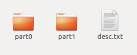
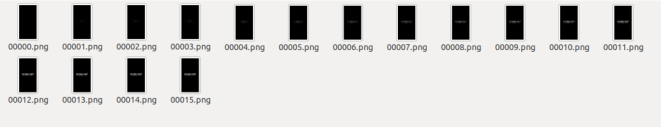
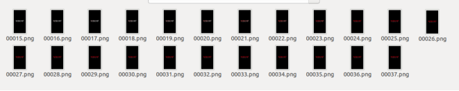
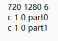
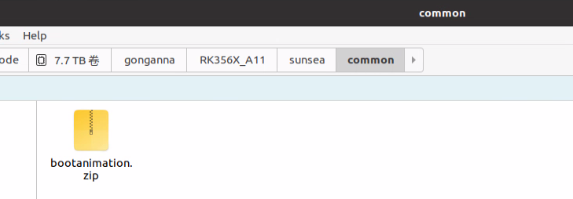
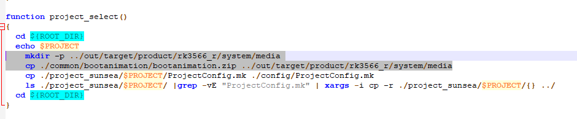
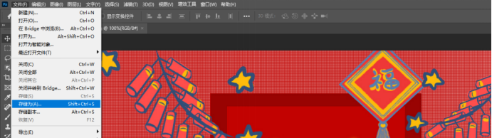
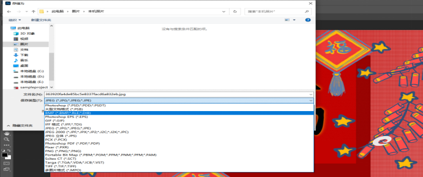
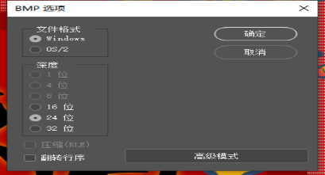

# SIM866X_Boot Animation Modification User Guide

## **Version History**

| **versions**|**date**|**author**|**remark**|
| :------- | :-------- | :------- | :------- |
| 1.00     |2026.03.24| Gong Anna| The first version |

## 1 Introduction

This document introduces how to add boot animation to Android 11 system of SIM866x module by taking EVB development board of SIM866x as an example. With reference to this application documentation, users can quickly customize boot animations.

## 2 Custom boot animation

Boot animation is essentially formed by a group of pictures played continuously.

Root privileges are required to modify boot animation. (Prerequisite, must)

The general practice is to replace the SIM 866x device system/media/bootanimation.zip file.

### 2.1 Boot animation package analysis

The animation package is called bootanimation.zip, and after decompression, the content is as follows:

The part0 ~ part 1 directory stores the pictures to be played. It is recommended that the picture resolution be consistent with the screen resolution.

The format of the image is.png, which needs to be named sequentially.

part0:

part1:

desc.txt: reads as follows

The first row of data represents the resolution and frame rate of the display: width (720)* height (1280), 6 represents the number of frames displayed in one second

The first character is fixed (currently only 'p' and 'c'). 'c' indicates that the segment cannot be interrupted during playback, while 'p' indicates that it can be interrupted. 
The second value represents the number of times this segment is played. 1 indicates one playback, while 0 indicates looping playback. 
The third represents the time interval (in frames) between this segment and the next one. 
The fourth one indicates the location of the image within this segment.

#### 2.2 Creating animation packages

(1)Create a folder called bootanimation to store animation resources, modeled on the above

(2)Enter the bootanimation directory in the ubuntu terminal and perform compression == zip -0 -r../ bootanimation.zip .**==

(3)At this point in the bootanimation level directory will create the animation package we need

#### 2.3 Put the animation package into the system source code

Prepare bootanimation.zip animation package that has been done,put it under sunsea/common/bootanimation,in the location shown in the following picture.

#### 2.4 Adding copy command to script to make animation package effective

mkdir -p ../ out/target/product/rk3566_r/system/media
cp ./ common/bootanimation/bootanimation.zip ../ out/target/product/rk3566_r/system/media

## 3 Modify the boot animation

Android system comes with a boot animation is a white "android" text flashing

We can change this animation to the animation we want. 

Remove android-logo-mask.png images from/frameworks/base/core/res/assets/images and add images to replace them. 

Background default is gradient effect can be replaced according to requirements android-logo-shine.png is the desired background effect picture

Note: Customizing boot animation and modifying default animation are mutually exclusive. The above are two ways to modify boot animation. Users can choose one according to their needs.

### How to convert images from other formats to bmp

You can use ps to open the picture and select File-> Save as

Select bmp format-> Save

Select file format and bit depth, click OK

