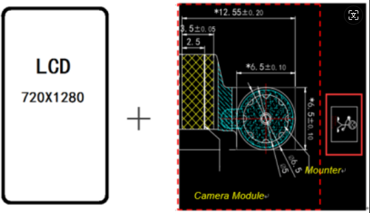
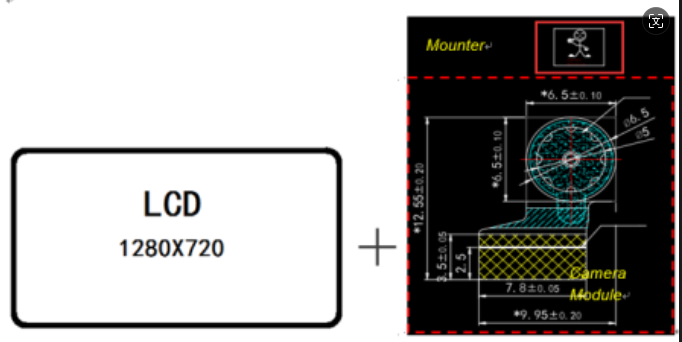
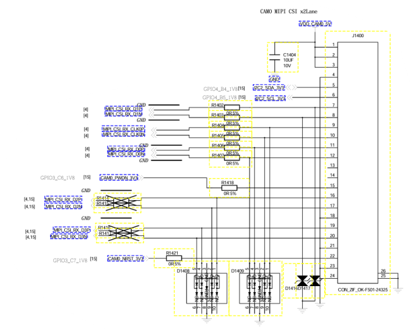

# SIM866X_Camera Driver Development Guide

## **Version History**

| **versions**|**date**    |**author**|**remark**         |
| :----- | :-------- | :----- | :------------- |
| 1.00   |Li Chengyi|2026.3.4| The first version   |
| 1.01   |Luo Bingkang| 2026.03.11| Add multi-channel AHD to MIPI correlation |

## 1 Introduction

This document takes the camera IMX415 on the EVB development board of SIM866X as an example to introduce how to light up the camera module on SIM 866x module Android 11 system.

Multi-channel AHD to MIPI This document takes tp2815 as an example
## 2 Camera module placement position

When designing the placement position of the camera module, it is necessary to pay attention to the positional relationship between the placement of the camera module and the display direction of the screen. In order to ensure that the preview image of the camera can be displayed normally on the screen (no image stretching), the long side of the photosensitive chip in the camera module should always face the long side of the display screen (the foot corresponding to the small person image in the figure always faces the long side of the display screen), as shown in the following figure:

If the display screen is vertical display, the installation direction of the camera module and the relative position of the display screen are as follows:




If the display screen is horizontal display, the installation direction of the camera module and the relative position of the display screen are as follows:



Note that if the camera module is not placed according to the above rules, the image display problem cannot be completely solved by software rotation angle, and the adjusted image will be cropped or stretched.


## 3 Hardware circuit schematic diagram



camera signal: camera power (dovdd dvdd avdd), clk, pwdn, rst, mipi

Some camera sensors may not have pwdn, subject to the camera sensor's datasheet;

Take the imx415 module as an example, only need to supply 5v, clk also uses the crystal oscillator that comes with the camera module; note, according to the camera hardware circuit connection schematic diagram and datasheet power-on timing configuration completed power, clock, reset, powerdown signal, you can read the sensor id through i2c.


## 4 Add drivers and effects

The path of the camera configuration file is as follows

1. Camera sensor drive path: kernel/drivers/media/i2c/imx415\_back.c

2. Camera sensor effect parameter file path: external/camera\_engine\_rkaiq/iqfiles/isp21/imx415\_back\_TongJu\_CHT842-MD.json

3. Profile.xml file path: hardware/rockchip/camera/etc/camera/camera3\_profiles\_rk356x.xml

4. Hardware dts-related configuration path: kernel/arch/arm64/boot/dts/rockchip/simcom/camera.dtsi

### 4.1 Configuring Hardware Circuit Connections

Taking imx415 as an example, this section focuses on how to configure power, reset, pwdn, clock and other signals according to the schematic diagram. The requested URL/boot/dts/rockchip/simcom/camera.dtsi was not found on this server.

```c
imx415_back: imx415_back@1a {
	status = "okay";
	//It needs to be consistent with the matching string in the driver.
	compatible = "sony,imx415_back";
	// Sensor I2C device address, 7 bits
	reg = <0x1a>;
	// Sensor MCLK source configuration
	clocks = <&cru CLK_CAM0_OUT>;
	clock-names = "xvclk";
	//Enabling of the sensor-related power domain
	power-domains = <&power RK3568_PD_VI>
	//Sensor MCLK Pinctl Settings
	pinctrl-names = "default";
	pinctrl-0 = <&cam_clkout0>;
	// Reset pin allocation and valid level
	reset-gpios = <&gpio3 RK_PC7 GPIO_ACTIVE_LOW>;
	// Powerdown pin allocation and valid level
	pwdn-gpios = <&gpio3 RK_PC6 GPIO_ACTIVE_HIGH>;
	// Module number. This number must not be repeated.
	rockchip,camera-module-index = <0>;
	//The module orientation includes "back" and "front".
	rockchip,camera-module-facing = "back";
	// Moduel Name
	rockchip,camera-module-name = "TongJu";
	// lens name
	rockchip,camera-module-lens-name = "CHT842-MD";
	port {
		imx415_back_out: endpoint {
			// The port name of the Csi2 Dphy end
			remote-endpoint = <&dphy1_in>;
			// CSI2 DPHY lane count, 1 lane is <1>, 4 lanes are <1 2 3 4>
			data-lanes = <1 2>;
		};
	};
};

```

Camera Sensor Power Configuration:

As mentioned above, IMX415 module only needs a 5v power supply; but usually sensor driver generally implements avdd/dvdd/dovdd three power supply operations, this time you need to add the following configuration to dts

```c
avdd-supply = <&vcc_avdd>; 
dovdd-supply = <&vcc_dovdd>; 
dvdd-supply = <&vcc_dvdd>;
```

If an external power supply such as LDO is used, the enable pin is controlled by gpio. You can configure vcc\_camera\_back as a power supply node by referring to the configuration method shown in the figure below. It is suitable for multiple devices to use the same power supply. It is recommended that dvdd power supply be supplied separately when multiple cameras are taken, avdd/dovdd can be shared, and when dvdd is shared, if the power is relatively large, there may be instantaneous insufficient supply, power collapse, affecting image quality, or even not showing.

```c
/ {
	vcc_camera_back: vcc-camera-back-regulator {
		compatible = "regulator-fixed";
		gpio = <&gpio4 RK_PC0 GPIO_ACTIVE_HIGH>;
		pinctrl-names = "default";
		pinctrl-0 = <&camera_back_pwr>;
		regulator-name = "vcc_camera_back";
		enable-active-high;
	};
};

&pinctrl {
	cam {
		camera_back_pwr: camera-back-pwr {
			rockchip,pins =
				/* camera power en */
				<4 RK_PC0 RK_FUNC_GPIO &pcfg_pull_none>;
		};
};
```

### 4.2 Adding Sensor Drivers

#### 4.2.1 raw sensor

For IMX415, add drivers to this path: kernel/drivers/media/i2c/

```c
imx415_back.c
```

Configure the Kconfig file, file path: kernel/drivers/media/i2c/Kconfig

```c
config VIDEO_IMX415_BACK
	tristate "Sony IMX415 sensor support"
	depends on I2C && VIDEO_V4L2 && VIDEO_V4L2_SUBDEV_API
	depends on MEDIA_CAMERA_SUPPORT
	help
	  This is a Video4Linux2 sensor driver for the Sony
	  IMX415 camera.

	  To compile this driver as a module, choose M here: the
	  module will be called imx415.
```

Configuration Makefile file, file path kernel/drivers/media/i2c/Makefile

```c
obj-$(CONFIG_VIDEO_IMX415_BACK)	+= imx415_back.o
```

***

#### 4.2.2 Multichannel AHD to MIPI

Take tp2815 as an example, add drivers to this path: kernel/drivers/media/i2c/

```c
└── techpoint
   ├── Makefile
   ├── techpoint_common.h
   ├── techpoint_dev.c
   ├── techpoint_dev.h
   ├── techpoint_tp2815.h
   ├── techpoint_tp2855.c
   ├── techpoint_tp2855.h
   └── techpoint_v4l2.c
```

Configure the Kconfig file, file path: kernel/drivers/media/i2c/Kconfig

```c
config VIDEO_TECHPOINT
	tristate "TechPoint decoder"
	depends on I2C && VIDEO_V4L2 && VIDEO_V4L2_SUBDEV_API
	depends on MEDIA_CAMERA_SUPPORT
	help
	  Support for the TechPoint Multichannel digital decode to
	  MIPI CSI-2 bridge.

	  To compile this driver as a module, choose M here: the
	  module will be called TechPoint.
```

Configuration Makefile file, file path kernel/drivers/media/i2c/Makefile

```c
obj-$(CONFIG_VIDEO_TECHPOINT) += techpoint/
```

### 4.3 Effect Parameter Configuration

== Note: Multi-channel AHD to MIPI, no effect file required, this column is only applicable to raw sensor==

#### 4.3.1 Modifying json files

For IMX415, add the effects file to this path: external/camera\_engine\_rkaiq/iqfiles/isp21/imx415\_back\_TongJu\_CHT842-MD.json

If there is no effect file, you can modify other effect files to replace, here only provides a simple way to make 3a run up to modify the effect file, good results need special debugging, IMX415 effect file is modified in accordance with this method.

Take imx415\_back\_TongJu\_CHT842-MD.json as an example:

Note file naming rules: sensor model\_*module name*\_lens name.json;

The specific model and module name can be obtained in the dts:

```dtsi
rockchip,camera-module-name = "TongJu";
rockchip,camera-module-lens-name = "CHT842-MD";
```

If the actual resolution of the current module is not consistent with the resolution in the modified Json file, the following changes need to be made. If it is consistent, you only need to change the file name.

For example, change the resolution from 3840 x 2160 to 1920 x 1080.

1. Change the beginning of json file to correspond to width and height 1920x1080

```c
		"resolution":	{
			"width":	3840,
			"height":	2160
		},
```

2. Replace all 3840 x 2160 directly with 1920 x 1080

3. Change the lsc close:enable attribute to 0

```c
"lsc_v2":	{
	"common":	{
		"enable":	0,
```

### 4.4 Profiles.xml file configuration

Take IMX415 as an example, profile.xml file path: hardware/rockchip/camera/etc/camera/camera3\_profiles\_rk356x.xml

camera3\_profiles\_rk356x.xml contains multiple Profiles nodes, which contain a complete list of camera properties. If you connect several sensors, you need to configure several Profiles nodes.

#### 4.4.1 Configuring Primary Nodes

The Profiles node contains the following four child nodes.

```c
<Profiles cameraId="0" name="imx415_back" moduleId="m00">
    <Supported_hardware>
    </Supported_hardware>

	<Android_metadata>
	</Android_metadata>
<!-- ******************PSL specific section start **************************************************************-->
	<Hal_tuning_RKISP1>
	</Hal_tuning_RKISP1>

	<Sensor_info_RKISP1>
	</Sensor_info_RKISP1>
<!-- ******************PSL specific section end **************************************************************-->
</Profiles>
```

The RK platform has provided a reference xml configuration file. In addition, camera3\_profiles\_default.xml provides a reference configuration for RAW sensor and SOC sensor (single-channel yuv sensor). Before configuration, confirm whether it is SOC or RAW sensor, and then configure it according to the corresponding reference configuration.

cameraId //is no longer a key item, configurable 0 or 1&#x20;

name //needs to be consistent with the driver name, pay attention to case difference&#x20;

moduleId key configuration item, value format is "mxx", where "m" is the abbreviation of "module","xx" is decimal number, indicating the unique number of camera, moduleId needs to be consistent with the configuration in the driver DTS, otherwise it will not load normally. In addition, when configuring multiple cameras, moduleId of multiple cameras need to be arranged in ascending order. as follow:


```xml
<Profiles cameraId="0" name="imx415_back" moduleId="m00">
...
</Profiles>
<Profiles cameraId="1" name="imx415_front" moduleId="m01">
...
</Profiles>
```

For details, please refer to the relevant documents in RKDocs/common/camera/HAL3/directory

#### 4.4.2 Direction of rotation

*   For SENSOR\_TYPE\_RAW and SENSOR\_TYPE\_SOC camera rotation direction, you can modify here

```c
<sensor.orientation value="90"/>
```

Note: For multi-channel AHD to MIPI and USB camera only works in/device/rockchip/common/external_camera_config.xml

```c
<!-- orientation -->
<Orientation  degree="180"/>
```

### 4.5 Hal Layer Configuration of Multichannel AHD to MIPI

To use multi-channel AHD to MIPI, you need to use Android usb camera hal: you need to add the following configuration to/sunsea/project_sunsea/SIM8666_XXX/ProjectConfig.mk

```C
CONFIG_USB_CAMERA_TEST=y
```

## 5 DEBUG

### 5.1 RAW SENSOR AND SOC SENSOR

Under normal circumstances, as long as the clk, power supply, rst, pwdn pins are correct, and the i2c address is correct, then there is no problem with i2c communication, and the sensor id can be obtained. If it's not normal, you need to measure the waveform. The most common is that there is no ack, which needs to check all the relevant contents mentioned above. If there is no i2c signal coming out (rarely), then pay attention to i2c iomux multiplexing and whether it is pulled dead by the rest of the peripherals.

Check imx415 registration success,Detected imx415 id 0000e0 Description i2c communication success

```c
[    2.375864] imx415_back 2-001a: driver version: 00.01.08
[    2.376341] imx415_back 2-001a:  Get hdr mode failed! no hdr default
[    2.376903] imx415_back 2-001a:  Get data lanes failed! 4 lanes default
[    2.377486] imx415_back 2-001a: detect imx415 lane 2
[    2.377957] imx415_back 2-001a: Failed to get power-gpios
[    2.378460] imx415_back 2-001a: no pinctrl
[    2.378864] imx415_back 2-001a: 2-001a supply dvdd not found, using dummy regulator
[    2.379594] imx415_back 2-001a: Linked as a consumer to regulator.0
[    2.380155] imx415_back 2-001a: 2-001a supply dovdd not found, using dummy regulator
[    2.380866] imx415_back 2-001a: 2-001a supply avdd not found, using dummy regulator
[    2.386125] vendor storage:20190527 ret = 0
[    2.452871] imx415_back 2-001a: Detected imx415 id 0000e0
```

### 5.2 Multi-channel AHD to MIPI 

Check if tp2815 is registered successfully,`chip_id_h:0x28 chip_id_l:0x55` Description: able to obtain chip id i2c communication success

```c
E techpoint 2-0044: techpoint->reset_gpio
E techpoint 2-0044: techpoint->reset_gpio out
E techpoint 2-0044: techpoint_initialize_devices:140
E techpoint 2-0044: chip_id_h:0x28 chip_id_l:0x55
I techpoint 2-0044: techpoint check chip id CHIP_TP2855 !
E techpoint 2-0044: tp2855_initialize:210
E techpoint 2-0044: tp2855_initialize
E techpoint 2-0044: techpoint_initialize_controls:171
```

Print in case of failure

```c
[    1.926007] techpoint 2-0044: chip_id_h:0xff chip_id_l:0xff
```

dump yuv command

```shell
v4l2-ctl -d /dev/video0 --set-fmt-video=width=1280,height=720,pixelformat=NV12 --stream-mmap=3 --stream-skip=30 --stream-to=/mnt/output_1.yuv --stream-count=1 --stream-poll
```

View link topology:

```shell
media-ctl -d /dev/media0 -p
```