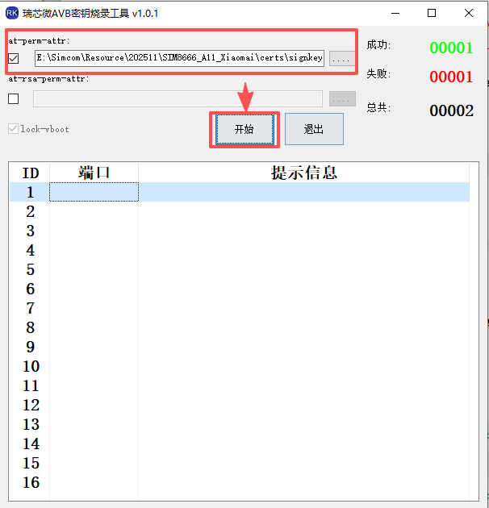
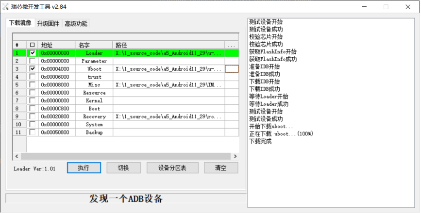
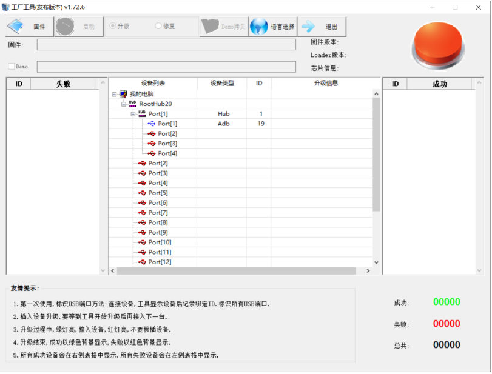

# SIM866X_Customer Configuration Secureboot\&AVB User Guide

## **Version History**

| **versions**|**date** |**author**|**remark**                                                     |
| -------- | ---------- | -------- | ------------------------------------------------------------ |
| 1.00     |2026.01.30|Yang Huakun| The first version|
| 1.01     |2026.03.24|Yang Huakun| second edition,modification point:<br/> Section 2.3.2 Replacement of AVB signature pre-log;<br/> Section 2.2 and Section 4.3.2 Modify Fallback AVB Macro Description<br/>|

## 1 Introduction

This document is used to guide the configuration and verification process of custom**Secure Boot (Secure Boot)** and**AVB (Android Verified Boot) signature mechanism**on**SIM866X_A11 (based on RK356X platform) intelligent module**. Through this guide, users can implement a complete boot chain trust check from BootROM → SPL → U-Boot → Android system, thus ensuring the integrity and security of device firmware and preventing unauthorized code from being loaded or tampered with.

In the safety system:

- **Secure Boot is**mainly used to verify the underlying boot chain (such as SPL, U-Boot, TEE, etc.) to ensure that boot components are trusted to sign
- **AVB**is used to verify Android system partitions (such as boot, system, vendor, etc.) to ensure that the system image has not been illegally modified.
- The combination of the two can achieve an end-to-end complete chain of trust

This solution supports customer-defined keys and provides two AVB Key burning methods (built-in or tool burning) to meet the different needs of R & D verification and mass production deployment.

------

### ️Important Notes (Must Pay Attention)

1. **Rollback protection**
   - Default can be disabled
   - Once turned on, the device will**not be able to refresh back to the old firmware version**
   - Unified management in combination with rollback index
2. **Fuse (eFuse) irreversible**
   - Once the-`--burn-key-hash`executed, the device enters a safe state (fuse)
   - After fuse:
     - ❌ No longer allowed to burn in unsigned (unfused) firmware
     - ❌ Firmware that cannot be replaced with another key signature
     - ✅ Only allow the firmware with the same key and a valid signature to be booted.
3. **The key must be kept properly.**
   - Secure Boot and AVB use private keys once lost:
     - It will no longer be possible to generate a bootable firmware.
     - The equipment may be permanently unable to be upgraded.

## 2 Preparation (must be confirmed)

### 2.1 Compilation environment validation

Verify that the build server fdtput version is version 1.4.5.

```bash
$ fdtput --version
#Version: DTC 1.4.5
```

If the fdtput version is less than 1.4.5, upgrade by executing the following command.

```bash
$ sudo apt-get install device-tree-compiler
```

### 2.2 Fallback AVBLIB Macro Configuration to Default State

AVB signature needs to open AVB\_LIBAVB related macro, otherwise after setting "BOARD\_AVB\_ENABLE := true" in Section 4.3.1 below, AVB cannot be started normally due to incomplete AVB function configuration found during boot process, so the boot fails, and the automatic restart enters fastboot mode.

Modifications:

    sunsea/project_sunsea/SIM8666_<YourProject>/ProjectConfig.mk

Modify the content:

```diff
-UBOOT_CONFIG_ANDROID_AVB=n
+UBOOT_CONFIG_ANDROID_AVB=y

-UBOOT_CONFIG_AVB_LIBAVB=n
-UBOOT_CONFIG_AVB_LIBAVB_AB=n
-UBOOT_CONFIG_AVB_LIBAVB_ATX=n
-UBOOT_CONFIG_AVB_LIBAVB_USER=n
-UBOOT_CONFIG_RK_AVB_LIBAVB_USER=n

+UBOOT_CONFIG_AVB_LIBAVB=y
+UBOOT_CONFIG_AVB_LIBAVB_AB=y
+UBOOT_CONFIG_AVB_LIBAVB_ATX=y
+UBOOT_CONFIG_AVB_LIBAVB_USER=y
+UBOOT_CONFIG_RK_AVB_LIBAVB_USER=y
```

**Note**: if sunsea/project_sunsea/SIM8666_<YourProject>/ProjectConfig.mk does not exist above 6 macros, please ignore; if there is, you must change n to y.

### 2.3 Check the initial signature status of the device

Burn the unfused firmware first to ensure it can boot properly.

#### 2.3.1 ADB View Mode

Read:

*   fuse.programmed=0 → Device not yet fused

*   androidboot.verifiedbootstate=orange or other → AVB not signed

#### 2.3.2 SPL UART Log View Mode

The default serial port board is connected to 3.3V and the baud rate is 1500000.

Secureboot: Verify that verified-boot is 0.

    ## verified-boot:0 //固件签名但是芯片没有熔断(1表示有熔断),没有进行hash有效性验证，即编译的时候没有加--burn-key-hash
    sha256.rsa2048:dev+
    ro11back index:1>=0(min)，OK //滚版本，即编译时加--ro1back-index-uboot
    //下面这些是uboot完整性的校验
    ## checking atf-1 0x00040000   ... sha256+ 0K
    ## checking uboot 0x00a00000   ... sha256+ 0K
    ## Checking fdt 0x00b2a018   ... sha256+ 0K
    ## checking atf-2 0xfdcc9000   ... sha256+ 0K
    ## checking atf-3 0xfdcd0000   ... sha256+ 0K
    ## checking optee 0x00200000   ... sha256+ 0K

AVB: Confirm vboot is 0.

```markdown
vboot=0, AvB images, AVB verify
read is device unlocked( ops returned that device is UNLOCKED
avb slot verify.c:762: ERROR: vbmeta: Error verifying vbmeta image: OK NOT SIGNED
get image from preloaded partition...
ANDROID: Hash OK
```

## 3 Secureboot Configuration&#x20;

### 3.1 Code modification

Enter the u-boot directory, open configs/rk3568\_defconfig for the corresponding platform, and select the following configuration:

```makefile
$ vim u-boot/configs/rk3568_defconfig
#Required
CONFIG_FIT_SIGNATURE=y
CONFIG_SPL_FIT_SIGNATURE=y
CONFIG_AVB_VBMETA_PUBLIC_KEY_VALIDATE=y

#Optional. Note: You can first default to not adding rollback protection for these two lines.
CONFIG_FIT_ROLLBACK_PROTECT=y //boot.img prevents rollback
CONFIG_SPL_FIT_ROLLBACK_PROTECT=y //uboot.img prevents rollback

Notes: During compilation, the comments // should be removed or replaced with #; otherwise, the compilation will fail.
```

### 3.2 Generating keys

```bash
$ cd u-boot/
$ mkdir -p keys
$ ../rkbin/tools/rk_sign_tool kk --bits 2048 --out .
$ cp private_key.pem keys/dev.key && cp public_key.pem keys/dev.pubkey
$ openssl req -batch -new -x509 -key keys/dev.key -out keys/dev.crt
```

Note: Perform this step once and save the keys properly.

    u-boot/private_key.pem
    u-boot/public_key.pem
    u-boot/keys/    #Need backup
    ├── dev.crt
    ├── dev.key
    └── dev.pubkey

### 3.3 Compilation scripts for modifying signatures

Secureboot to sign u-boot, need to compile u-boot, and compile u-boot in the root directory of the global compilation script build.sh has been defined, so add fuse parameters in the following command.

```makefile
chmod 0777 build.sh
#Modify inside  build.sh from
cd u-boot && make clean && make mrproper && make distclean && ./make.sh $UBOOT_DEFCONFIG && cd -
# to
cd u-boot && make clean && make mrproper && make distclean && ./make.sh $UBOOT_DEFCONFIG --spl-new --burn-key-hash && cd -
```

Parameter Description:
\--spl-new //repackage signed spl.
\--burn-key-hash //Add this compile option to cause chip fusing when booting after firmware burn.

Additional parameters:
\--rollback-index-uboot<version number>//Set the version number. When anti-rollback is configured in the config in Section 3.1, this compilation option needs to be added, otherwise it is not needed [Note: You can leave it out for the first verification].

## 4 AVB Signature Configuration

### 4.1 Compile avbtool&#x20;

```bash
$ mmma external/avb/ -j16
```

The requested URL/host/linux-x86/bin/avbtool was not found on this server.
Note: or directly use the source code external/avb/avbtool (this can be used first, the following command as an example).

### 4.2 Generating atx\_permanent\_attributes.bin

Modify Product ID:

```diff
$ cd external/avb/
$ vim test/avb_atx_generate_test_data


diff --git a/test/avb_atx_generate_test_data b/test/avb_atx_generate_test_data
index 1b8bb2b..2220688 100755
--- a/test/avb_atx_generate_test_data
+++ b/test/avb_atx_generate_test_data
@@ -48,7 +48,7 @@ AVBTOOL=$(dirname "$0")/../avbtool
 echo AVBTOOL = ${AVBTOOL}

 # Get a zero product ID.
-echo 00000000000000000000000000000000 | xxd -r -p - atx_product_id.bin
+echo 00000000000000000000000000000123 | xxd -r -p - atx_product_id.bin

 # Generate key pairs.
 if [ ! -f testkey_atx_prk.pem ]; then
```

Note: The product ID has 16 digits, and the value can be defined by yourself; the avb_atx_generate_test_data command below will generate atx\_permanent\_attributes.bin.

Note: The above example is 123.

Execute the command to generate avb keys.

```bash
$ cd external/avb/test/data
$ rm -rf testkey_atx*.pem
$ ../avb_atx_generate_test_data
```

Note: The pem key needs to be regenerated only once, i.e. the script needs to be executed only once.

```bash
$ git status #查看生成效果 ，请备份好以下modified文件！只需要生成一次！！！
        modified:   ../avb_atx_generate_test_data
        modified:   atx_metadata.bin
        modified:   atx_permanent_attributes.bin
        modified:   atx_pik_certificate.bin
        modified:   atx_product_id.bin
        modified:   atx_psk_certificate.bin
        modified:   atx_puk_certificate.bin
        modified:   atx_unlock_challenge.bin
        modified:   atx_unlock_credential.bin
        modified:   testkey_atx_pik.pem
        modified:   testkey_atx_prk.pem
        modified:   testkey_atx_psk.pem
        modified:   testkey_atx_puk.pem
```

### 4.3 Code modification

#### 4.3.1 Amendment 1&#x20;

\$ device/rockchip/rk356x/rk3566\_r/BoardConfig.mk

```diff
@@ -37,3 +37,9 @@ ifeq ($(strip $(BOARD_USES_AB_IMAGE)), true)
   include device/rockchip/common/BoardConfig_AB.mk
   TARGET_RECOVERY_FSTAB := device/rockchip/rk356x/rk3566_r/recovery.fstab_AB
 endif
+
+BOARD_AVB_ENABLE := true
+BOARD_AVB_ALGORITHM := SHA256_RSA4096
+BOARD_AVB_KEY_PATH := external/avb/test/data/testkey_atx_psk.pem
+BOARD_AVB_METADATA_BIN_PATH := external/avb/test/data/atx_metadata.bin
+BOARD_AVB_ROLLBACK_INDEX := 0 
```

Macroanalysis:
BOARD\_AVB\_ENABLE := true //Turn AVB on
BOARD\_AVB\_ALGORITM:= SHA256\_RSA4096 //Configure encryption algorithm
BOARD\_AVB\_KEY\_PATH := external/avb/test/data/testkey\_atx\_psk.pem //key storage path
BOARD\_AVB\_METADATA\_BIN\_PATH := external/avb/test/data/atx\_metadata. bin//Specify metadata file
\#BOARD\_AVB\_ROLLBACK\_INDEX := 0 //Configure anti-version rollback, which is not enabled by default. It is enabled according to requirements and needs to be modified with uboot.

#### 4.3.2 Amendment II

sunsea/project\_sunsea/SIM8666\_\<YourProject>/ProjectConfig.mk
Note: After compiling ProjectConfig.mk, UBOOT-related macros will be automatically summarized into u-boot/configs/rk3568\_defconfig, so relevant macro configurations can be uniformly configured into sunsea/project\_sunsea/SIM8666\_\<YourProject>/ProjectConfig.mk.

```diff
@@ -41,13 +41,18 @@ UBOOT_CONFIG_PHY_ROCKCHIP_NANENG_COMBOPHY=n
 UBOOT_CONFIG_PHY_ROCKCHIP_NANENG_EDP=n

#Should the spl uart log be printed? This log also enables you to view the current fuse status. For detailed instructions, please refer to Section 7.
-UBOOT_CONFIG_DISABLE_CONSOLE=y
+#UBOOT_CONFIG_DISABLE_CONSOLE=y

#AVB Signature-related Macro Configuration
+UBOOT_CONFIG_FIT_SIGNATURE=y
+UBOOT_CONFIG_SPL_FIT_SIGNATURE=y
+UBOOT_CONFIG_RK_AVB_LIBAVB_ENABLE_ATH_UNLOCK=y
+UBOOT_CONFIG_AVB_VBMETA_PUBLIC_KEY_VALIDATE=y
+#UBOOT_CONFIG_ANDROID_AVB_ROLLBACK_INDEX=y
 ####################################################################
 # kernel
 ###############
```

Macroanalysis:
//Optional
\+UBOOT\_CONFIG\_ANDROID\_AVB\_ROLLBACK\_INDEX=y //The anti-rollback function is configured only if this function is required. It needs to be configured together with BOARD\_AVB\_ROLLBACK\_INDEX on the lower surface of the device.

Note: Add prefix "UBOOT\_" to AVB macro in ProjectConfig.mk.

### 4.4 AVB key burning

#### 4.4.1 Method 1: Built-in AVB key in code

AVB key is integrated into uboot code and burned into the machine together with firmware. There is no need to burn AVB key with AVB key tool. This way SDK does not support it by default. You need to patch it under uboot.&#x20;

Patch path: RKDocs/common/security/patch/u-boot/0001-avb-add-embedded-key.patch

```bash
$ cd u-boot
$ patch -p1 < ../RKDocs/common/security/patch/u-boot/0001-avb-add-embedded-key.patch
```

Patch will modify the following two files,
u-boot/common/android\_bootloader.c
u-boot/lib/avb/libavb\_user/avb\_ops\_user.c
Because before reorganization, the sunsea/project\_sunsea/SIM8666\_\<your\_project> file will be copied to the trunk code;

So check if sunsea/project\_sunsea/SIM8666\_\<your\_project>/u-boot/common/android\_bootloader.c file exists
Then synchronously modify u-boot/common/android\_bootloader.c to sunsea/project\_sunsea/SIM8666\_\<your\_project>/u-boot/common/android\_bootloader.c.

**public key extraction**

```bash
$ cd ../external/avb/
$ avbtool extract_public_key --key ../../external/avb/test/data/testkey_atx_psk.pem --output avb_root_pub.bin
$ xxd -i avb_root_pub.bin > ../../external/avb/test/data/avb_root_pub.h
$ cat test/data/avb_root_pub.h
```

Generate the following files:

    avb_root_pub.bin
    test/data/avb_root_pub.h

**Replacement public key**&#x20;

The extracted public key (external/avb/test/data/avb\_root\_pub.h) replaces the avb\_root\_pub array in u-boot/lib/avb/libavb\_user/avb\_ops\_user.c.

Note:

The array name in test/data/avb\_root\_pub.h is avb\_root\_pub\_bin\[], which needs to be changed to avb\_root\_pub\[] consistent with the patch.

```bash
vim u-boot/lib/avb/libavb_user/avb_ops_user.c
```

```c
avb_ops_user.c代码搜索示例：
u-boot/lib/avb/libavb_user$ grep -rniC10 "avb_root_pub" avb_ops_user.c
178-            blk_dread(dev_desc, part_info.start + offset_blk,
179-                      blkcnt, buffer_temp);
180-
181-    memcpy(buffer_temp, buffer + (offset % 512), num_bytes);
182-    blk_dwrite(dev_desc, part_info.start + offset_blk, blkcnt, buffer);
183-    free(buffer_temp);
184-
185-    return AVB_IO_RESULT_OK;
186-}
187-
188:unsigned char avb_root_pub[] = {
189-  0x00, 0x00, 0x10, 0x00, 0x1f, 0x8e, 0x54, 0x9b, 0xb2, 0xda, 0x61, 0xf0,
190-  0x8c, 0x2d, 0xf2, 0x94, 0x21, 0x45, 0x77, 0x33, 0x64, 0x64, 0xf2, 0x8e,
191-  0x89, 0x9c, 0xeb, 0x52, 0x23, 0xda, 0xc1, 0xef, 0x0e, 0x15, 0xc4, 0xc9,
192-  0x3b, 0x24, 0x8c, 0xbf, 0x4f, 0xcf, 0xe1, 0xf2, 0x0b, 0x0e, 0x26, 0x6e,
193-  0x84, 0x2d, 0x55, 0x2f, 0x03, 0x07, 0xaa, 0xe4, 0x7a, 0x91, 0x08, 0x6f,
194-  0xc8, 0xff, 0x5f, 0x7d, 0xe1, 0xe5, 0x5b, 0x72, 0x47, 0x96, 0x28, 0x88,
195-  0x14, 0xe7, 0x12, 0xef, 0x56, 0xf1, 0x94, 0xed, 0x5a, 0xa9, 0x56, 0x05,
196-  0xb7, 0x7a, 0x85, 0xf0, 0x0f, 0xea, 0x15, 0x5a, 0xee, 0x2e, 0x3a, 0x70,
197-  0x87, 0x8e, 0xfe, 0x58, 0x43, 0xdf, 0x5a, 0x70, 0x84, 0x79, 0x7d, 0xa2,
198-  0xf1, 0x11, 0xa9, 0x50, 0x58, 0x7f, 0xa1, 0xcd, 0x84, 0xcb, 0x50, 0xef,
```

#### 4.4.2 Method 2: AVB key programming tool programming

Note: For method 2, please burn the firmware after compiling the firmware in section 5; for example, burn update.img, and verify this step after the device can be booted normally, and write the Avb key to the firmware.

Writing tool: AvbKeyWriter (RKTools/windows/AvbKeyWriter-v1.0.1.7z).

Burn the source file: external/avb/test/data produced in Section 4.2 generates atx\_permanent\_attributes.bin.

Burning mode: check at-perm-attr to import external/avb/test/data produced in section 4.2 to generate atx\_permanent\_attributes.bin and enter loader mode.

Enter loader mode to add:

```bash
$ adb reboot loader
```

Click on "Power on button to burn."



## 5 firmware compilation

```bash
$ cd sunsea
format:  ./make_build_ap.sh [PROJECT] [MODULE] [userdebug/user] [thread_number]
example: ./make_build_ap.sh SIM8666_<YourPorject> all userdebug 16
```

build module:\[all] \[U] \[CK] \[A] \[p] \[o] \[u] \[d]
No ARGS means use default build option
all = -AUCKuo  build all
U = build uboot   #Secureboot Signature Section
C = build kernel with Clang
K = build kernel
A = build android
p = will build packaging in IMAGE
o = build OTA package
u = build update.img
cf = generate and copy all configuration files only.

For example, compile rockdev/Image-rk3566\_r/update.img

## 6 firmware burning

During the development phase, AndroidTool is used to burn the compiled firmware.



In the mass production phase, the update.img compiled in Section 5 is written using the mass production tool.



## 7 Start Verification

### 7.1 adb validation

If the fuse can be turned on normally,
Reading fuse.programmed=1 means Secureboot has fused successfully,
Read androidboot.verifiedbootstate=green for avb to take effect, orange or otherwise not.

```bash
$ adb root && adb shell
$ cat /proc/cmdline
storagemedia=emmc androidboot.storagemedia=emmc androidboot.mode=normal androidboot.dtb_idx=0 androidboot.dtbo_idx=0 fuse.programmed=1 androidboot.vbmeta.device=PARTUUID=dd040000-0000-4029-8000-669c00003143 androidboot.vbmeta.avb_version=1.1 androidboot.vbmeta.device_state=locked androidboot.vbmeta.hash_alg=sha256 androidboot.vbmeta.size=8640 androidboot.vbmeta.digest=c37843bae8763be29fea10117dd4b3dbb83e820dd4c10a5753e2943ca2d4d243 androidboot.veritymode=enforcing androidboot.verifiedbootstate=green androidboot.serialno=71ad384dc0367574 loglevel=7 androidboot.wificountrycode=CN androidboot.hardware=rk30board androidboot.console=ttyFIQ0 firmware_class.path=/vendor/etc/firmware init=/init rootwait ro init=/init loop.max_part=7 buildvariant=userdebug console=ttyFIQ0 androidboot.boot_devices=fe310000.sdhci,fe330000.nandc
```

### 7.2 SPL Uart Log Verification

Prerequisite: SPL UART Log needs to be enabled before compiling.
Specific steps:
Confirm comments in sunsea/project\_sunsea/SIM8666\_\<YourProject>/ProjectConfig.mk,

```diff
-UBOOT_CONFIG_DISABLE_CONSOLE=y
+#UBOOT_CONFIG_DISABLE_CONSOLE=y
```

And make sure that the CONFIG\_DISABLE\_CONSOLE=y line is not in u-boot/configs/rk3568\_defconfig.

Success logs are as follows:

Verified-boot: 1 #1 indicates fuse

Vboot=1, SecureBoot enabled, AVB verify

    ···
    U-Boot SPL board init
    U-Boot SPL 2017.09-gf4c11e73cd-dirty #chenyubin (Jan 29 2026 - 10:37:52)
    Trying to boot from MMC2
    Card did not respond to voltage select!
    mmc_init: -95, time 10
    spl: mmc init failed with error: -95
    Trying to boot from MMC1
    SPL: A/B-slot: _a, successful: 0, tries-remain: 7
    Trying fit image at 0x4000 sector
    
    Verified-boot: 1  #1表示有熔断
    sha256,rsa2048:dev## Verified-boot: 1
    +
    Checking atf-1 0x00040000 ... sha256(0d5225a4ab...) + OK
    Checking uboot 0x00a00000 ... sha256(ed07016bdd...) + OK
    Checking fdt 0x00b00ca0 ... sha256(19b435a15b...) + OK
    Checking atf-2 0xfdcc1000 ... sha256(3e94d16e6a...) + OK
    Checking atf-3 0x0006b000 ... sha256(fde0ef262b...) + OK
    Checking atf-4 0xfdcd0000 ... sha256(befba422b8...) + OK
    Checking atf-5 0xfdcce000 ... sha256(c9eb312bf2...) + OK
    Checking atf-6 0x00069000 ... sha256(6ede7a3b44...) + OK
    Checking optee 0x08400000 ... sha256(af414b9c9f...) + OK
    Jumping to U-Boot(0x00a00000) via ARM Trusted Firmware(0x00040000)
    Total: 140.963 ms
    INFO: Preloader serial: 2
    .....
    
      aclk_perimid 300000 KHz
      hclk_perimid 150000 KHz
      pclk_pmu 100000 KHz
    Net:   eth1: ethernet@fe010000
    Hit key to stop autoboot('CTRL+C'):  0 
    ANDROID: reboot reason: "(none)"
    optee api revision: 2.0
    Vboot=1, SecureBoot enabled, AVB verify 
    read_is_device_unlocked() ops returned that device is LOCKED
    ANDROID: Hash OK
    custom_target_serialno: pInfo.serialno:, pInfo.loglevel:.
    custom sn isnot exist
    loglevel_value = 7.
    Booting IMAGE kernel at 0x00280000 with fdt at 0x0a100000...
    ···

