# SIM866X_Firmware Burning Guide

## **Version History**

| **versions**|**date**   |**author**|**remark**                   |
| -------- | ---------- | -------- | -------------------------- |
| 1.00     |2025.08.29| Zhu Qingyi| The first version |
| 1.01     |2026.03.17|Yang Huakun| Second edition, docx to markdown documentation|

## 1 Introduction

This document is mainly used to guide the firmware burning process of SIM866X Android 11 platform module, covering the preparation of burning tools, driver installation, device mode description and the burning method of complete firmware and partition level firmware.

This document is intended for R&D\testing and FAE personnel and focuses on common burning methods based on Rockchip platform, including:

- Use RKDevTool to burn firmware (update.img)
- Use fastboot / fastbootd for dynamic partition burning
- Access methods and applicable scenarios for different device startup modes (MaskROM / Loader / Normal)

With this guide, users can:

- Quickly build burning environment (tools + drivers)
- Correctly identify equipment connection status
- Perform firmware upgrade or single-partition debugging burn
- Handle common brush scenarios (such as brick rescue, GSI test, etc.)

## 2 Download tools

RKDevTool is an official firmware burning tool provided by Rockchip. It is mainly used to flash, upgrade and debug firmware of RK series chip devices through USB interface on Windows platform. It is one of the most commonly used production/maintenance tools for the RK platform.

### 2.1 Operating environment

This software runs on Windows XP, Vista, Win7, Win10, Win11 platforms and requires at least one available USB port.

### 2.2 RKDevTool Tools and Drivers

Please contact SIMCom FAE if you do not have related tools and drivers.

#### 2.2.1 RKDevTool

Download tool path in source code:

```
RK356X_A11\RKTools\windows\AndroidTool\RKDevTool_Release_v2.93.zip
```

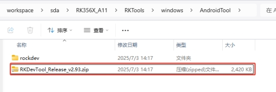 

Compressed package content:

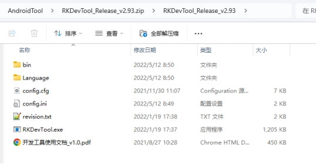 

Double click RKDevTool.exe to start the download tool after extracting the driver.

#### 2.2.2 DriverAssitant

USB driver path in source code:

```
RK356X_A11\RKTools\windows\DriverAssitant_v5.1.1.zip
```

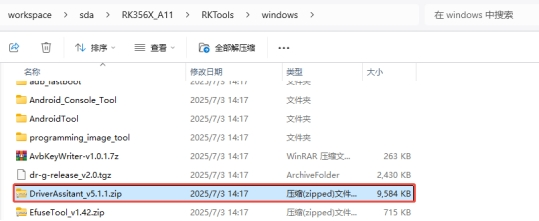 

Compressed package content:

 

 After decompression, execute DriverInstall.exe installation!

### 2.3 Fastboot Tools and Drivers

#### 2.3.1 platform-tools

Please contact FAE to provide platform-tools-10039.zip.

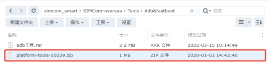 

 Compressed package content:

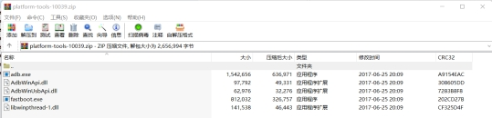 

Decompress to local, add path to system variable, easy to use.

1. Right-click the desktop icon "This Computer"> Properties;

2. Click "Advanced System Settings" to

 

Click on "Environment variables" and

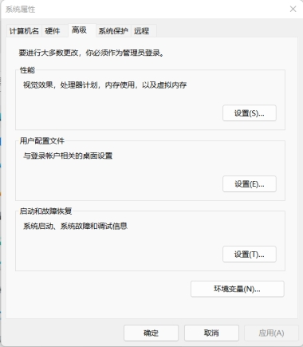 

3. Click "Path"

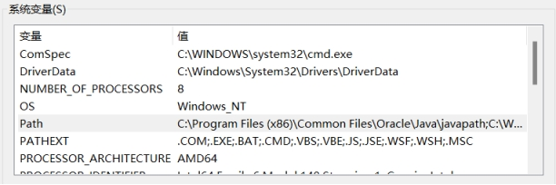 

4. Add the path you just decompressed

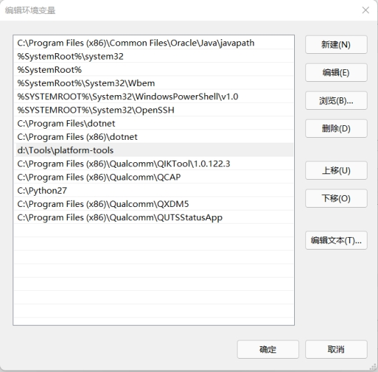 

5. Click OK.

6. Press the key combination "Win+R" and enter "CMD"

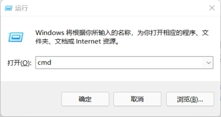 

Enter the following command to check if the addition is successful

```bash
$ adb version
$ fastboot --version
```

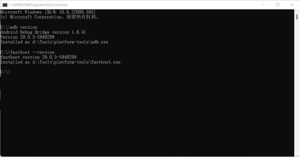

#### 2.3.2  usb driver

Please contact FAE to provide USB driver usb_driver_r13-windows.zip.

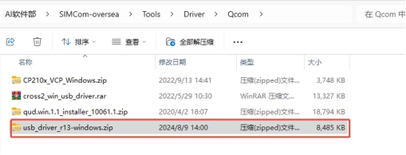 

Compressed package content:

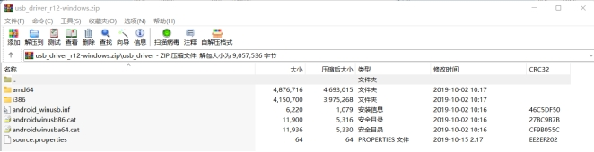 

If a yellow flag appears on the ADB interface in Windows Device Manager, do the following: 

1. Double-click Android Composite ADB Interface and go to the Driver tab. 

2. Click Update Driver, select Install from a list or specific location (Advanced), and click Next. 

3. Click Don't search, I will choose the driver to install and click Next. 

4. Select My Computer and click Next. 

5. Click Have Disk and then Browse. Specify the inf file location as the path you just extracted.

6. Click OK in the installer window, then click Next, which installs the driver for the ADB interface.


## 3 Target device status

### 3.1 Download mode

1. MaskROM mode

It is the bottom emergency mode of the chip built-in BootROM, mainly used to save bricks.

Operating characteristics:

Can burn firmware (full image, including Bootloader, Kernel, System and other partitions);

You can operate on partitions, but usually the full amount of operation is the main, separate partition brush writing function is limited by tool support;

Does not rely on Bootloader on the device, so it can rescue severely damaged equipment.

2. Loader mode

Bootloader is provided by the brush mode, located on MaskROM.

Operating characteristics:

Partition-level operations (individually write boot, system, recovery, userdata, etc.);

Upgrade firmware or restore system, depending on Bootloader to load normally;

It is usually flexible and suitable for development or production environments.

#### 3.1.1 Equipment shutdown

As shown in the figure below, plug in the 12V power supply and TypeC cable, press the Power key and Boot short circuit at the same time, and enter MASKROM mode.

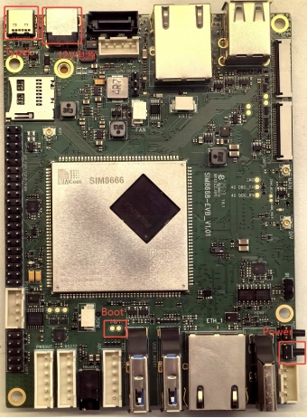 

When the device is in MASKROM mode, the port information in the RKDevTool main window will display "Found a MASKROM device."

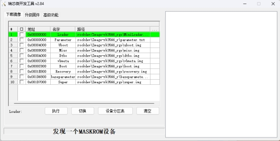 

#### 3.1.2 Equipment startup status

In the CMD terminal window, execute:

```bash
$ adb reboot loader
```

, enter loader mode;

When the device is in loader mode, the port information in the RKDevTool main window will display "Found a LOADER device."

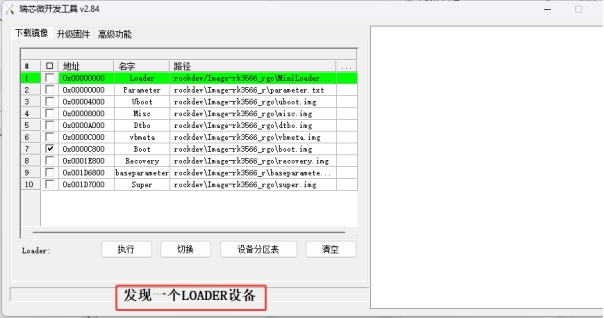 

 Port information is displayed in Device Manager.

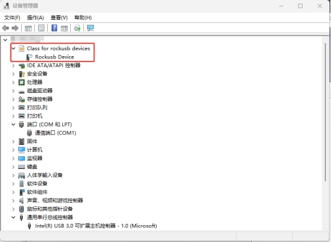 

### 3.2 Normal startup mode

In the RK(Rockchip) platform, Normal Mode / System Mode refers to the working mode in which the processor starts to execute the boot process from BootROM after the device is powered on and finally enters the complete operating system running environment.

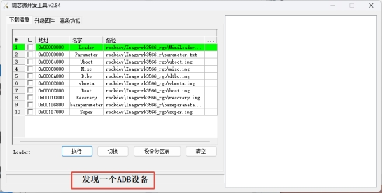 

Port information is displayed in Device Manager.

 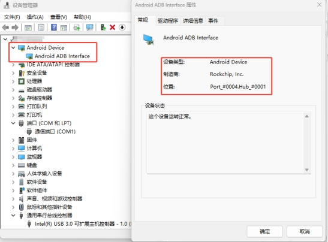 

## 4 Brush firmware using RKDevTool

### 4.1 Start RKDevTool

1.  Ensure QPST, QXDM Pro, J-Tag/T32, SSCOM are closed. 

2. Click on RKDevTool.exe and the image below shows the main RKDevTool window when no target devices are connected to the computer.


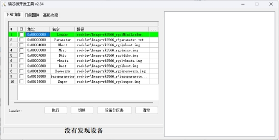 

### 4.2 Import the whole package burning firmware

Import the compiled firmware updata.img into the download tool as follows.

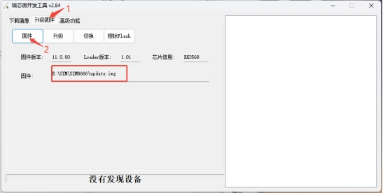 

### 4.3 Start downloading

Switch the device to MaskROM mode, click Upgrade, and the window on the right shows the firmware download progress.

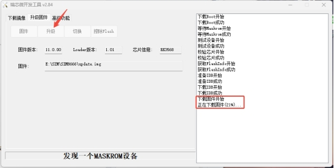 

### 4.4 End of download

After successful download, the window on the right shows that the firmware download is successful, the device restarts, and the device restarts successfully and is re-identified as an adb device.

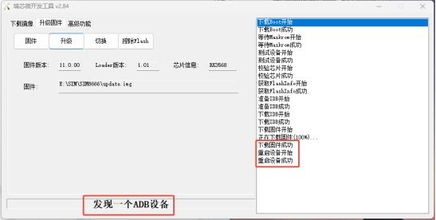 

## 5 firmware description

### 5.1 Compile and generate firmware

After complete compilation, the following file will be generated, and the tool can be written as update.img.

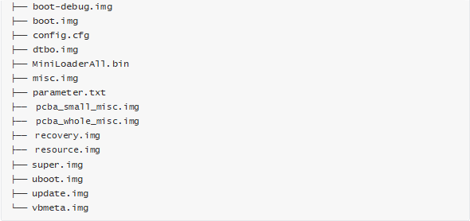 

### 5.2 Firmware Details

| firmware                | explain                                                         |
| ------------------- | ------------------------------------------------------------ |
| boot.img            | Ramdisk, kernel, dtb.                                   |
| boot-debug.img      | The difference with boot.img is that user firmware can burn this boot.img for root operations. |
| dtbo.img            | Device Tree Overlays Refer to dtbo section below for instructions.                |
| config.cfg          | The configuration file of the burning tool can be directly imported into the burning tool to display the options that need to be burned. |
| MiniLoaderAll.bin   | It contains a primary loader.                                             |
| misc.img            | Contains recovery-wipe boot identification information, which will be recovered after burning.        |
| parameter.txt       | Contains partition information.                                               |
| pcba_small_misc.img |Contains pcba boot identification information, burned into a simple version of pcba mode.           |
| pcba_whole_misc.img |Contains pcba boot identification information, burned into the full version of pcba mode.           |
| recovery.img        | Contains recovery-ramdisk, kernel, dtb.                          |
| super.img           | Contains odm, product, vendor, system, system_ext partition content.       |
| trust.img           | Includes BL31, BL32   RK3566/RK3568 does not generate this firmware, no burn is required. |
| uboot.img           | Includes uboot firmware.                                              |
| vbmeta.img          | Contains avb check information for AVB check.                               |
| update.img          | Contains the img file that needs to be burned, which can be used to directly burn the entire firmware package.  |

## 6 fastboot Burn Dynamic Partition

RK's new device supports dynamic partitioning. The system/vendor/odm/product/system_ext partition has been removed. Please burn super.img and system/vendor/odm separately (you can find the corresponding img file under out). You can use fastbootd to require both adb and fastboot versions to be the latest. The SDK provides compiled toolkits:

```
RKTools/linux/Linux_adb_fastboot (Linux_x86版本) 
RKTools/windows/adb_fastboot (Windows_x86版本)
```

### 6.1 Burning dynamic partitions

```shell
$ adb reboot fastboot
$ fastboot flash vendor vendor.img 
$ fastboot flash system system.img 
$ fastboot flash odm odm.img
```

After entering fastbootd mode, relevant equipment information will be displayed on the screen, as shown in the figure:

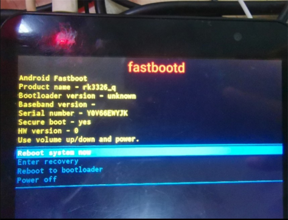

### 6.2 Burning non-dynamic partitions

To use fastboot, go to bootloader:

```bash
$ adb reboot bootloader
```

How to write GSI:

After confirming that the machine is unlocked, enter fastbootd, just burn system.img in GSI and misc.img in firmware, and enter recovery to restore factory settings after burning. Below is the entire burning process:

Restart to bootloader, not unlocked-> Machine unlocked:

```bash
$ adb reboot bootloader
$ fastboot oem at-unlock-vboot ## 对于烧写过avb公钥的客户，请参考对应的文档解锁。
```

Restore factory settings, reboot to fastbootd:

```bash
$ fastboot flash misc misc.img
$ fastboot reboot fastboot ## 此时将进入fastbootd
```

Start writing GSI

```bash
$ fastboot delete-logical-partition product ## (可选)对于分区空间紧张的设备，可以先执行本条命令删除product分区后再烧写GSI
$ fastboot flash system system.img 
$ fastboot reboot ## 烧写成功后，重启
```

GSI can also be written using DSU(Dynamic System Updates), which is already supported by Rockchip by default. Due to the large amount of memory consumed by this function, it is not recommended to use 1G DDR and the following devices. For the description and use of DSU, please refer to Android official website:[https://source.android.com/devices/tech/ota/dynamic-system-updates](https://source.android.com/devices/tech/ota/dynamic-system-updates)

Note 1: During VTS test, it is necessary to burn the compiled boot-debug.img to boot partition at the same time; 

Note 2: When CTS-ON-GSI is tested, it is not necessary to burn boot-debug.img;

Note 3: Please use Google's official GSI with a-signed ending when testing.
