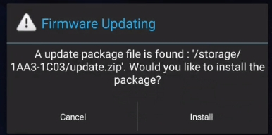
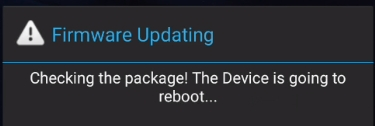

# SIM866X_OTA Upgrade User Guide

## **Version History**

| **versions**|**date**   |**author**|**remark**|
| -------- | ---------- | -------- | -------- |
| 1.00     |2026.03.04| Yang Huakun| The first version |

## 1 Introduction

### 1.1 Purpose of this article

This article is based on the Android 11 system of SIM866X platform, focusing on the OTA upgrade implementation method under**the non-AB partition architecture**, the upgrade package production process and the actual upgrade operation steps.

Through this document, developers can:

- Understand the application scenarios of OTA full volume packet and differential packet
- Master the compilation and generation methods of OTA upgrade packages
- Familiarity with Recovery based multiple local upgrade methods (SD card/ ADB)
- Quickly complete OTA function debugging and problem positioning in the project

### 1.2 References

[1]Ruixin Micro Platform Related Code

[2]Android Developer Documentation

### **1.3**Terminology and abbreviations

|  type| remark                                                         |
| :----: | ------------------------------------------------------------ |
| full package| An OTA full package is an upgrade package that includes the complete new version. It contains all the files and data that need to be updated, whether new or modified, will be included in the full package. Compared with differential packet, full packet has larger file size and longer transmission time. When the device receives the full package, it completely replaces the old version with the new version. |
| Subcontract| An OTA differential package is an upgrade package that contains only the differences between the new version and the old version. It contains only a portion of the file or data that needs to be updated, and the differential packet is smaller in size and faster than the full packet. After the device receives the differential package, it will update incrementally based on the old version, updating only the difference part, thus achieving the upgrade. |

## 2 Change OTA package name and version number

Edit the build/make/core/version_defaults.mk file.

```makefile
286 HAS_BUILD_NUMBER := true
287 ifndef BUILD_NUMBER
288   # BUILD_NUMBER should be set to the source control value that
289   # represents the current state of the source code.  E.g., a
290   # perforce changelist number or a git hash.  Can be an arbitrary string
291   # (to allow for source control that uses something other than numbers),
292   # but must be a single word and a valid file name.
293   #
294   # If no BUILD_NUMBER is set, create a useful "I am an engineering build
295   # from this date/time" value.  Make it start with a non-digit so that
296   # anyone trying to parse it as an integer will probably get "0".
297   BUILD_NUMBER := eng.$(shell echo $${BUILD_USERNAME:0:6}).$(shell $(DATE) +%Y%m%d.%H%M%S)
298   HAS_BUILD_NUMBER := false
299 endif
300 .KATI_READONLY := BUILD_NUMBER HAS_BUILD_NUMBER
```

such as modifying

~~~makefile
```
BUILD_NUMBER := eng.$(shell echo $${BUILD_USERNAME:0:6}).$(shell $(DATE) +%Y%m%d.%H%M%S)
```
~~~

is the required version number

SIM8666_B01V01

## 3 Compile to generate OTA package

Go to sunsea directory and execute compilation

format:  ./ make_build_ap.sh [PROJECT] [MODULE] [userdebug/user] [thread_number]

example: ./ make_build_ap.sh SIM8666 all userdebug 16

After the above command is executed successfully, the OTA upgrade package will be generated in the out/dist directory and finally copied to the rockdev/Image-rk3566_r directory.

| type       | package name keyword         | build directory               | remark                                                         |
| ---------- | ------------------ | ---------------------- | ------------------------------------------------------------ |
| full package     |-*ota*.zip         |  rockdev/Image-rk3566_r |The full package can be used directly as an upgrade package for upgrades.                           |
| differential resource package|  *-target_files.zip | rockdev/Image-rk3566_r |Take two different differential resource packages and make the generated differential package, which can be used as an upgrade package for upgrading. |

## 4 Differential packet making

Say it before:

***Source of\*source.zip\* ***and***\*target.zip\****:

| type                 | package name keyword                  | build directory| remark                                            |
| -------------------- | --------------------------- | -------- | ----------------------------------------------- |
| ***\*source.zip\****|previous version of-target_files.zip|  out/dist |\****source.zip\**** Name can be modified without special characters|
| ***\*target.zip\****|Current version of-target_files.zip|  out/dist |\****target.zip\**** Name can be modified without special characters|

Where***\*source.zip\* ***refers to the differential resource package of the previous version,***\*target.zip\**** refers to the differential resource package of this version, and update.zip is the name of the generated differential package.


Take the Android11 userdebug version as an example:

Open a new command window and execute the following command:

```bash
$ source build/envsetup.sh
$ lunch <product>-<variant>
$./build/make/tools/releasetools/ota_from_target_files -v --block -k build/target/product/security/testkey -p out/host/linux-x86/ -i <source.zip资源包路径> <target.zip资源包路径> <update.zip差分包的生成路径>
```

Analysis of key parameters:

- lunch<product>-<variant>   For example, lunch rk3566_r-userdebug ` 用于选择编译目标，其中 `rk3566_r is the device configuration and userdebug is the compilation type.

- out/host/linux-x86/bin/ota_from_target_files is a python script generated by the compilation environment. Before using it, you must execute source build/envsetup.sh and lunch qssi-userdebug.
- -v Display log of execution process;
- -k The key to sign the upgrade package. By default, it is build/target/product/security/testkey. If it is changed to a custom release key later, please use build/target/product/security/release when generating the difference package.


Other: Command execution common error reasons: 

1) The above "-" is in English format. Please note that when copying, it will automatically become "-" in Chinese, so the command will report an error;

2) The resource package path is incorrect;

3) Python 2.7 and other tool environments are not configured well

## 5 OTA package or differential package upgrade steps

Say it before:

As mentioned above, both OTA full volume packages and OTA differential packages can be upgraded as OTA upgrade packages.

Note 1: Mode 1, 2, 3 and 4 are all local OTA upgrades;

Note 2: The current system is**non-AB partition**, and can be upgraded by using Mode 1, Mode 2 and Mode 3;

###  5.1 Method 1: Update via SD card

Step 1: Change the OTA upgrade package to update.zip, put it in the SD card root directory, and then insert the SD card into the target device.

Step 2: When the device recognizes that update.zip compressed package exists in SD card root directory, an upgrade pop-up box pops up, as follows



Select Install.

Step 3: Wait for the upgrade to succeed.



Step 4: wait for 1-2 minutes, upgrade successfully, prompt as follows, click "yes", delete the upgrade package in sd card.


### 5.2 Method 2 Upgrade and update via SD card

Step 1: Put the OTA upgrade package into the SD card, and then insert the SD card into the target device;

Step 2: After booting the device, enter adb reboot recovery to enter recovery mode and select "Apply update from SD card";

Step 3: Wait for the upgrade to succeed.

### 5.3 Method 3: Update via ADB

Step 1: After booting the device, execute adb reboot recovery and select "Apply update from ADB";

Step 2: input adb sideload upgrade package on computer terminal, wait for upgrade to succeed.

### 5.4 Method 4: Support third-party FOTA application upgrade

For details, please contact FOTA supplier, who will provide relevant FOTA upgrade function system integration configuration information and FOTA upgrade management platform related accounts.

 